# 文章1：卡其裤+蓝衬衫，简单且高级

卡其裤的时尚地位不用多说，不管是《安妮霍尔》里，那条可以定位知性女郎地位的卡其裤穿搭。

还是凯拉奈特莉在电影《再次出发之纽约遇见你》里面，用一件蓝衬衫把卡其裤穿的过目难忘。

总之，这是一条可以代表知性、智性、文艺属性的裤子，它背后代表着广大的办公室女郎和都市文化工作者。

所以说它是女性衣橱必备，一点也没有夸张。而且就其功能性来说，它的颜色较为讨巧，占据了深浅适中的优势。

比起白裤子的难以驾驭、黑裤子偶尔的沉闷，卡其色的温和，更容易搭配出适合春夏季的着装。

但我们一提到卡其裤，总是习惯性的想到配白衬衫，虽然极为经典，但也少了一些醒目和出其不意。

而蓝衬衫正好弥补了白色的普遍性，且蓝调的清爽和干净，正好可以叫醒卡其色的土色感。

让大地与天空接壤，大自然赠予的配色，永远都是最美的。

而且蓝色给人的聪明味道，与卡其色的知性气息，正好代表了都市女性最为显著的特征。

卡其裤

怎么选？

卡其裤在裤型上没有什么特别注意的，以自己的喜好为准，但在颜色上需要参考自己的肤色来定。

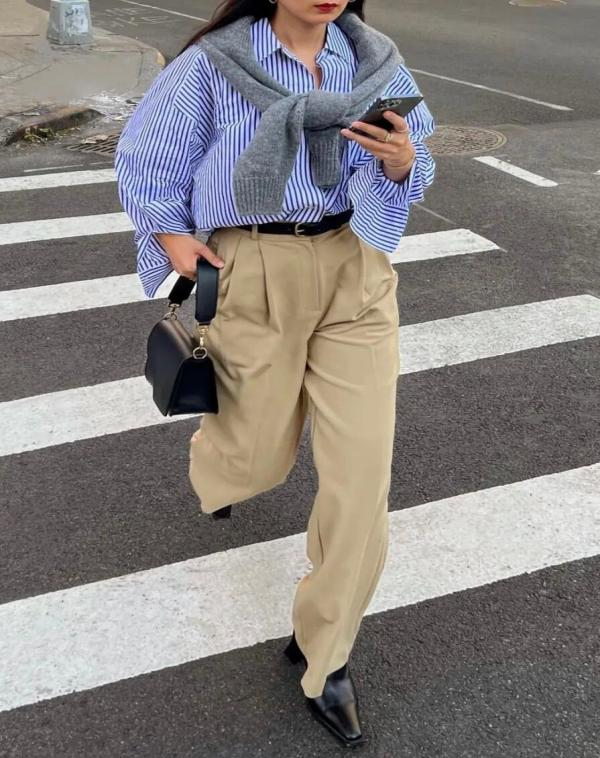

马上快到夏季，白调多的浅卡其更好搭配，对黄皮更友好，看起来更加干净温和。👆

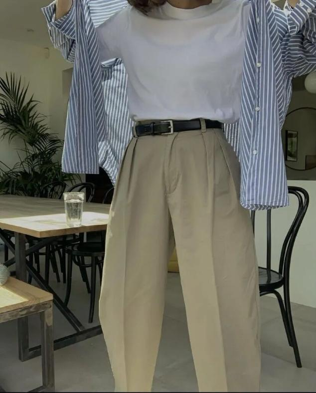

其次是泛绿调的卡其色，虽然没有白调浅卡其显白，但是绿调本身较为温和，只要上衣搭的好，绿卡其反而很耐看。

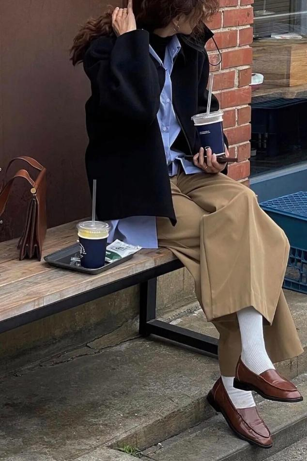

最后才是偏棕调的黄卡其，质感较为沉稳，但对黄皮来说稍显暗沉，所以选择需谨慎。

卡其裤+

不同蓝衬衫

在蓝衬衫的选择上，可以根据不同蓝调和不同风格款式来搭配。

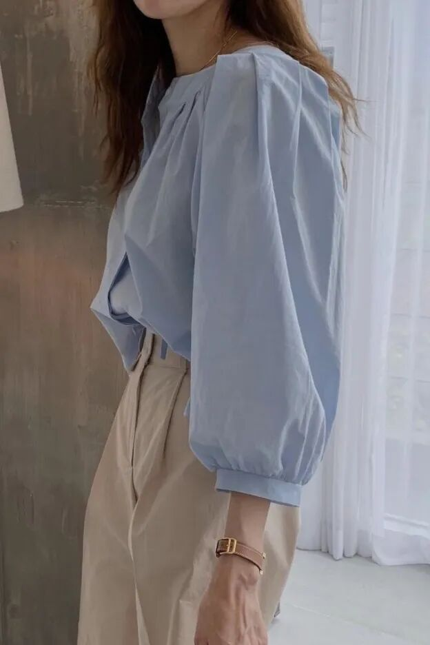

搭纯色蓝衬衫

如果喜欢制造清透文雅的形象，那么婴儿蓝这种浅色调的蓝非常养眼，搭配浅卡其在视觉上有种淡淡的高级感。👆

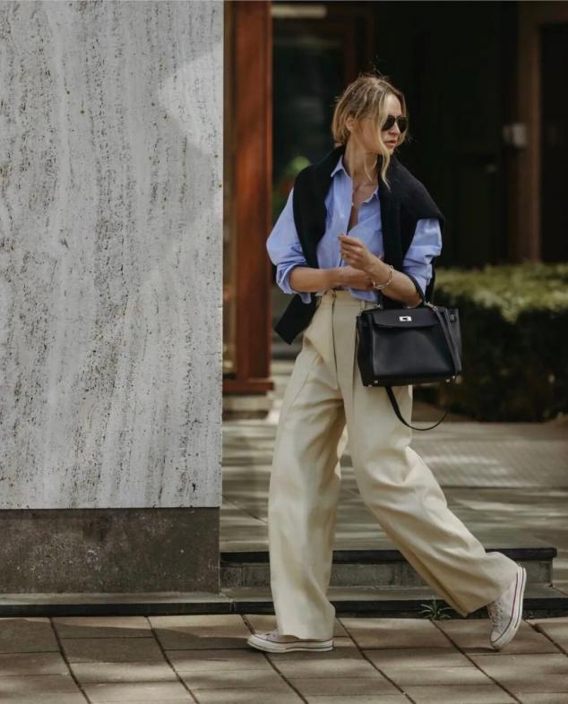

中蓝色衬衫也不错，比浅蓝有质感，比深蓝好驾驭，不管搭配什么色调的卡其裤，都给人知性潇洒的气息。

或者一件蓝色牛仔衬衫也很好，扑面而来的学院气质，同时还可以把卡其裤调动的更年轻。

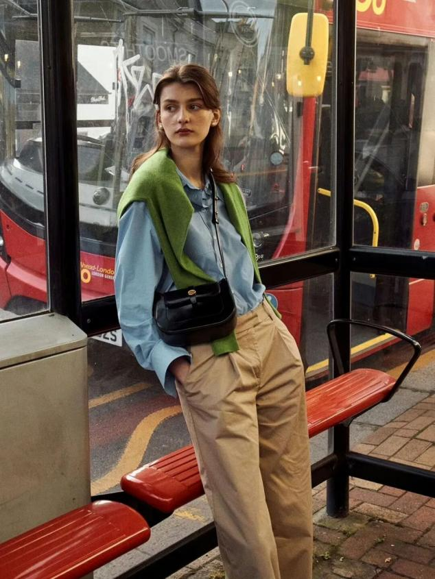

如果觉得单穿衬衫卡其裤单调了些，不妨增加一些其他色调来增加冲突感，比如一点点牛油果绿很是复古点睛。

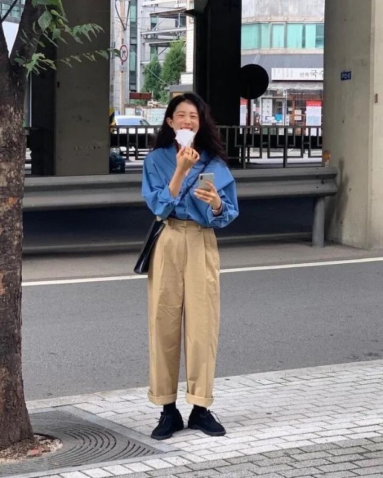

克莱因蓝比起前两种蓝调，是一种更具强烈视觉入侵感的颜色，先声夺人的抓人眼球。

同时因它自带艺术感染力，所以总是能把卡其裤搭配出高阶时装的属性来。

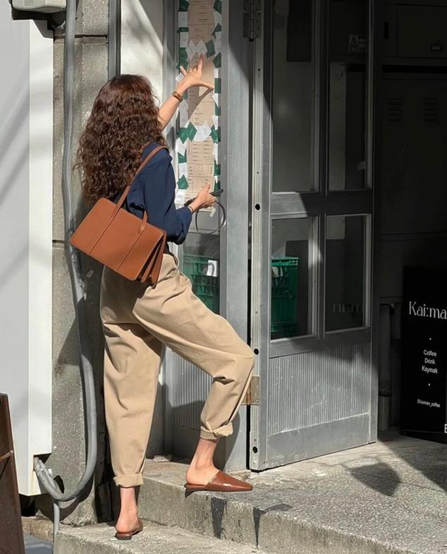

其实藏蓝色也是很好的经典色，有些人觉得它暗沉，但它的蓝更为成熟稳重，自带低调的贵族魅力，所以搭配卡其裤，几乎是天然的和谐。

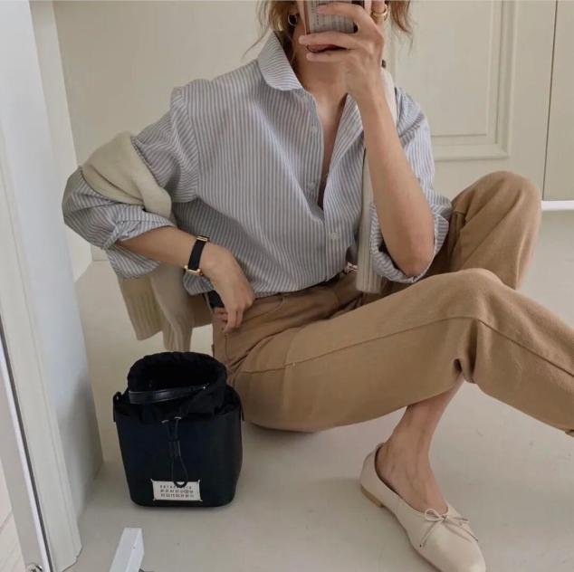

搭蓝色条纹衬衫

除了纯色系，蓝色条纹衬衫也是日常经典必备，她的精英属性和聪明气质，跟卡其裤的文雅正好异曲同工。

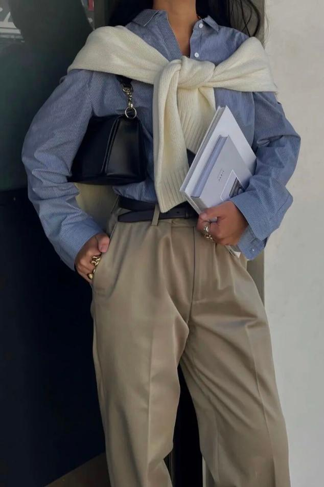

也更符合都市女性对于美的多维度追求，在条纹衫的选择上，条纹越细职业属性越强。

若想营造高智高精英风范，那么细节的手表和皮鞋不可或缺。

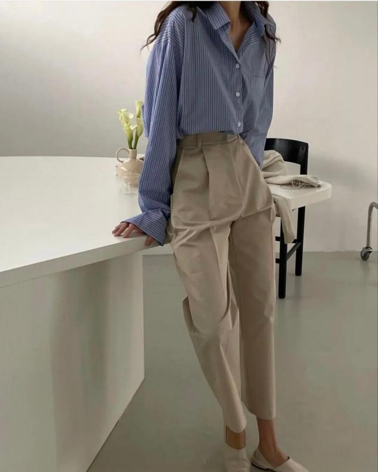

但若想把条纹穿的松弛休闲一些，那么条纹的间距可以宽一点，同时搭配一双平底鞋就能适时的融入生活。

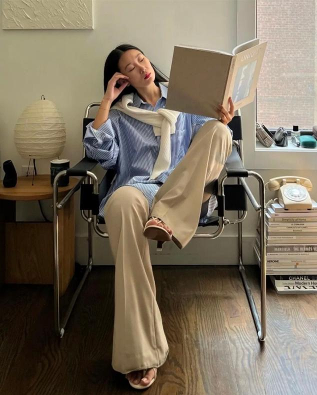

而且蓝白条的衬衫，因为白色的加入，可以让卡其裤的颜色更加清浅舒适。

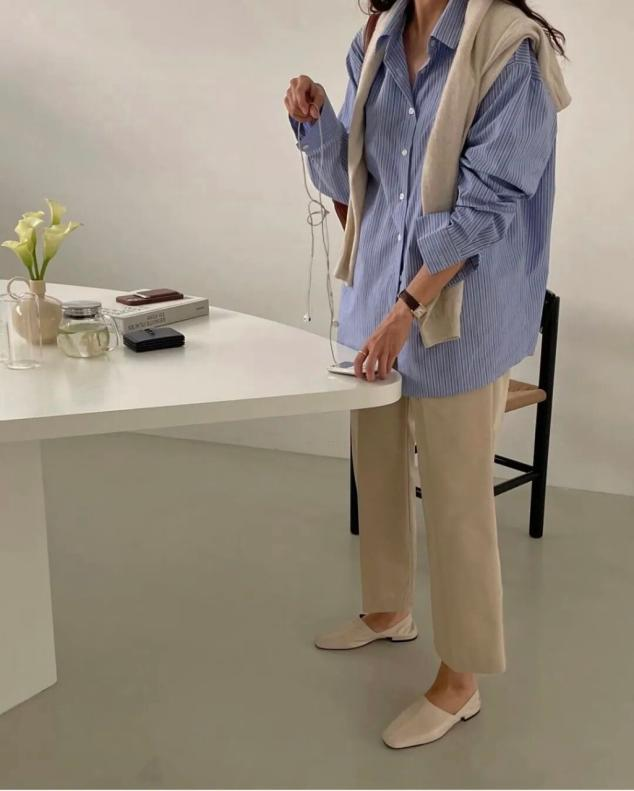

在搭配上，可以参考韩系博主这样，用随性的包包和披肩来营造慵懒氛围，这样条纹衫才能穿的既知性又很轻松时髦。

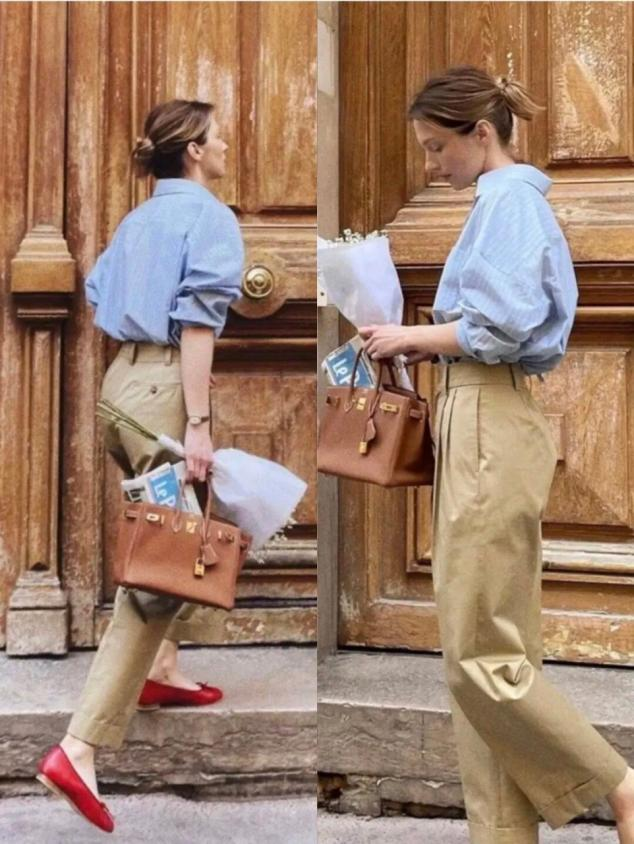

也可以搭配一双红色芭蕾舞鞋，浪漫化的点睛之笔，可以让这一身知性着装变得更加优雅精致。

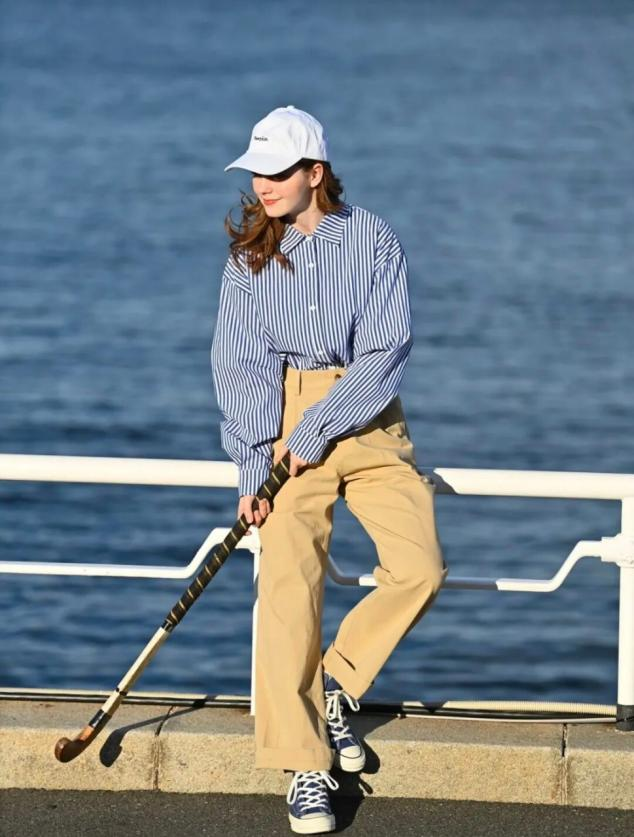

另外，条纹越宽度假感越强，对于不喜欢精英气质的女性来说，宽条纹+oversize就是最好的选择。

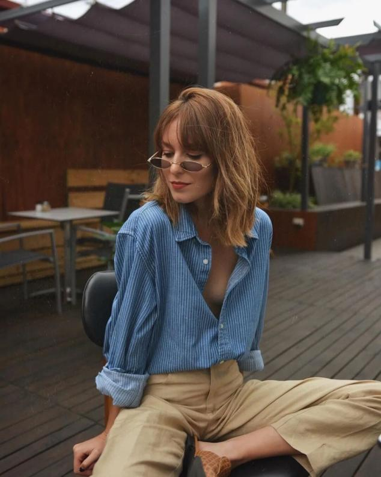

蓝衬衫的冷静和清爽，正好衔接卡其裤的温和和朴素，迷人的互补CP，越是反差越是能彰显自我。
