# 文章2：是时候穿上连衣裙+平底鞋了，美爆春夏

一到春夏，没有哪个女生能够拒绝连衣裙，从浪漫文艺的碎花裙、干练简约的衬衫裙到清爽撩人的吊带裙，但是怎么搭配ne？

有的人穿着仙仙的裙子，却选错了鞋子，那造型只能是零分。如何选择一双合适的鞋子，让你的连衣裙搭配更加吸睛出彩？

连衣裙+小白鞋

说到百搭单品一定少不了小白鞋，它和连衣裙的组合很适合用来诠释随性的青春感。

春夏必备的碎花裙有了小白鞋的加持更显活泼可爱，飘逸灵动的裙摆你真的不爱吗？这样的搭配很适合拍一组旅游大片，分分钟点爆朋友圈的那种。

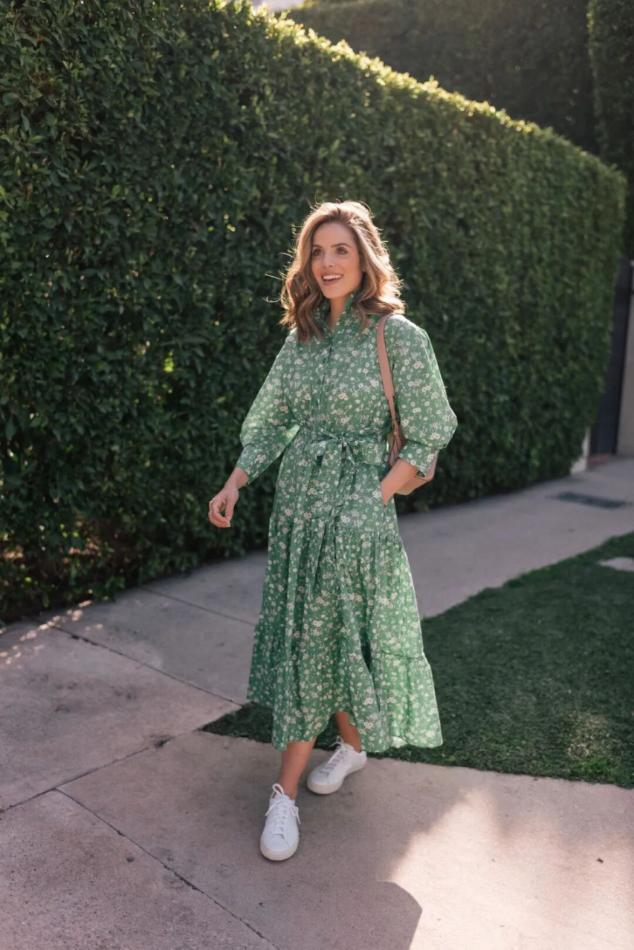

外搭一件皮衣会更适合北方的温度，美丽保暖两不误，穿上小白鞋的你依然可以做个酷酷的机车girl。

就连日常比较难驾驭的亮色连衣裙，在小白鞋的面前则显得随性慵懒起来，外扎一个丸子头还能减龄不少哦。

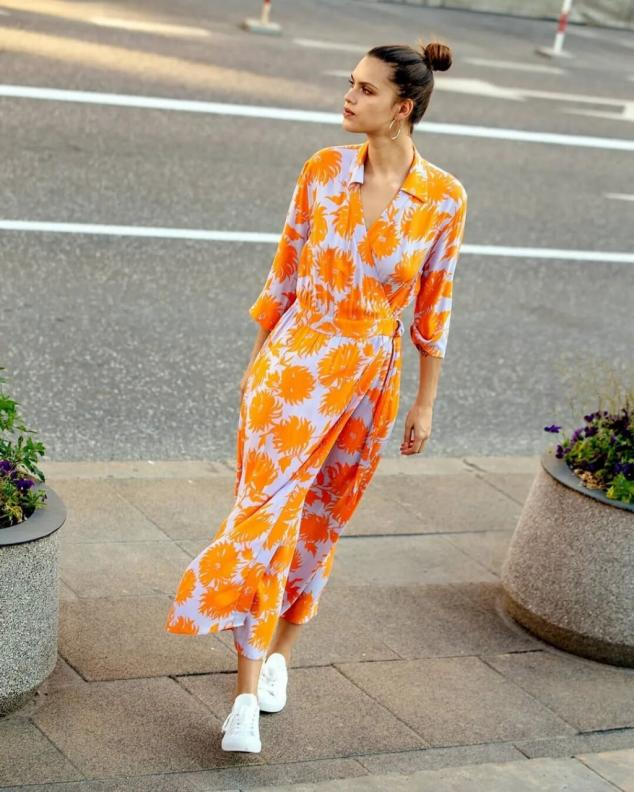

图案个性的吊带长裙混搭小白鞋，少了一分刻板，多了一分浪漫，舒适感爆棚的同时也美得十分少女~

吊带缎面长裙很容易穿出睡衣的feel，但搭配了小白鞋反而match得很好，不费力的easy chic一秒拥有！套上一件格纹西装就可以美美地去上班，干练又撩人！

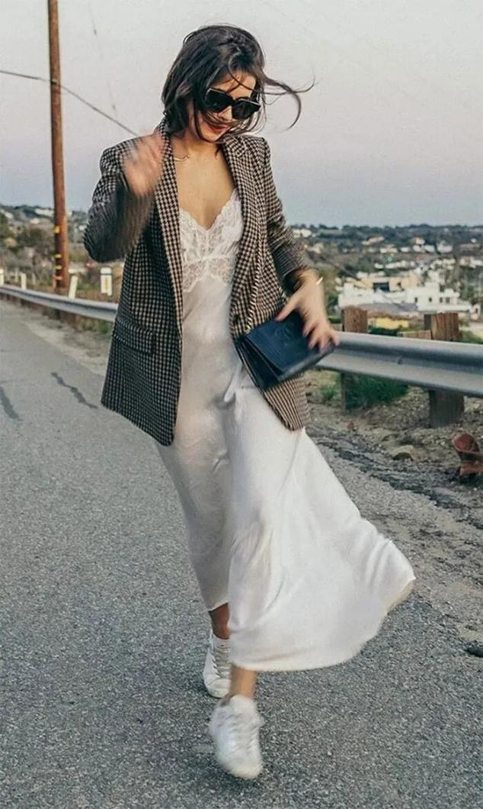

连衣裙+尖头鞋

把鞋柜里的尖头鞋拿出来搭配连衣裙，是一个频频被时尚大片翻牌的一个组合，总能将时尚度和造型感掌握得恰到好处。

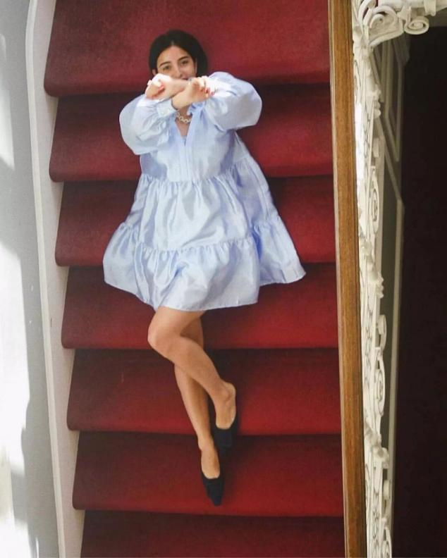

浅口款的尖头鞋在视觉上还能很好地拉长腿部线条，修饰腿型，这和长裙简直是绝配。

同色系搭配是最不容易出错的，黑色长裙搭配同色系尖头鞋，外搭一件灰色西装，让你在时髦炸街与office tine中完美切换。

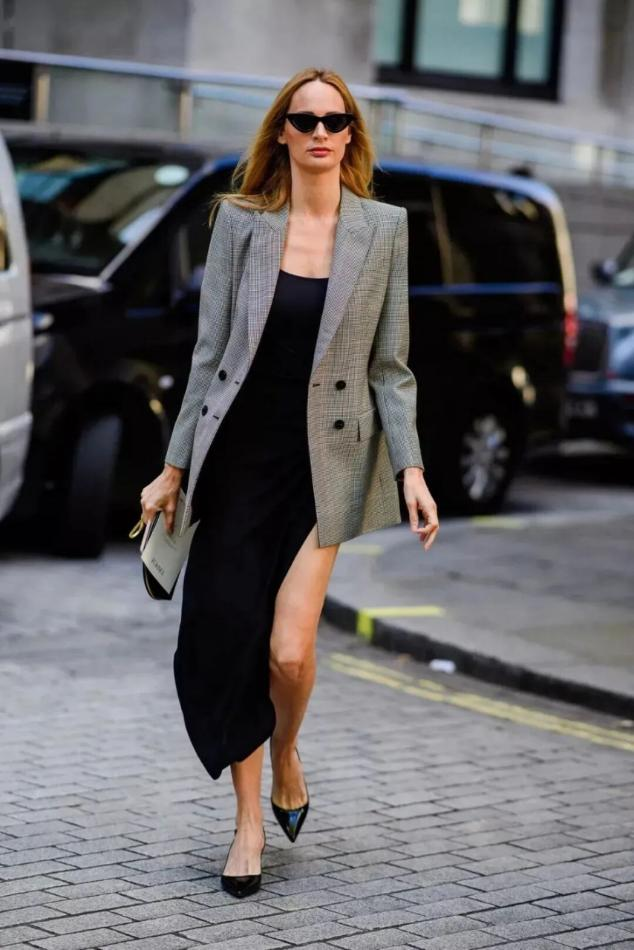

波点尖头鞋则具趣味性，搭配单色连衣裙实现美貌与质感的升级，不容易撞款~

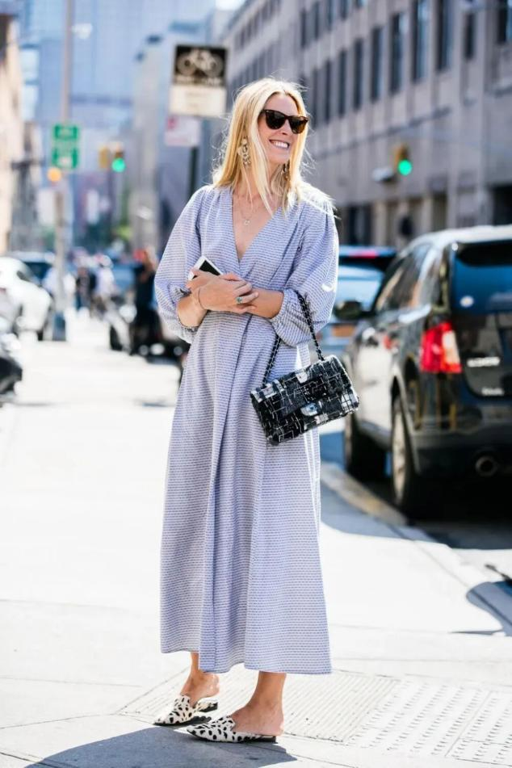

粉色连衣裙和金色尖头鞋是很少见的搭配，但效果意外惊喜，活泼感爆棚的同时显得格外少女，不妨试一试。

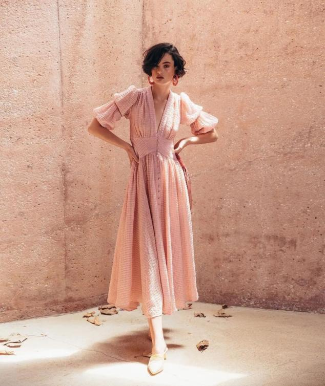

连衣裙+乐福鞋

更喜欢文艺复古的，那连衣裙＋乐福鞋的组合会更适合你。

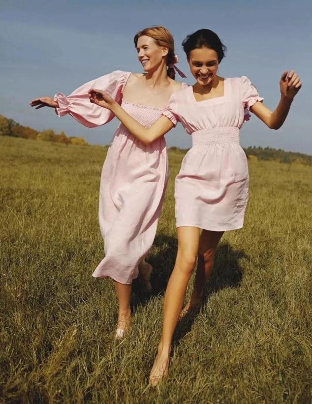

乐福鞋代表一种休闲自在的生活态度，搭配简约设计的连衣裙，有种别样的腔调。

最常见的黑色乐福鞋，和甜美的粉色连衣裙搭配给人以随性又浪漫的感觉，当之无愧的实穿系列搭配。

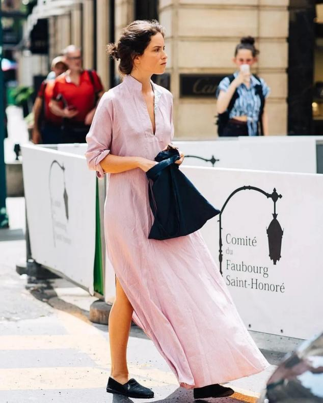

浅色系衬衫裙难免显得无趣，但点缀上一双豹纹乐福鞋，一切显得那么特别，休闲与个性的界限被拿捏得恰到好处~

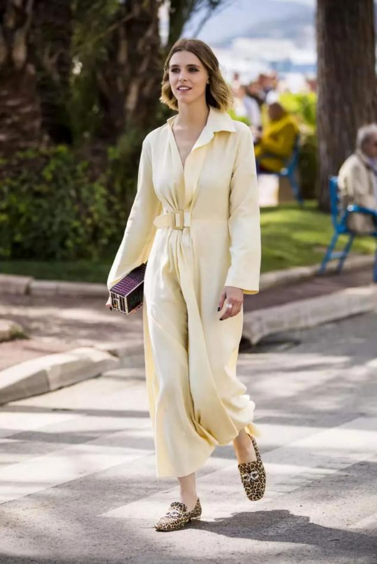

连衣裙+老爹鞋

老爹鞋街头范十足又非常实穿，当遇上女性化的连衣裙，势必碰撞出火花。

波点连衣裙搭配黑白配色老爹鞋，简单的配色彰显不俗品味，还有种法式休闲的韵味。

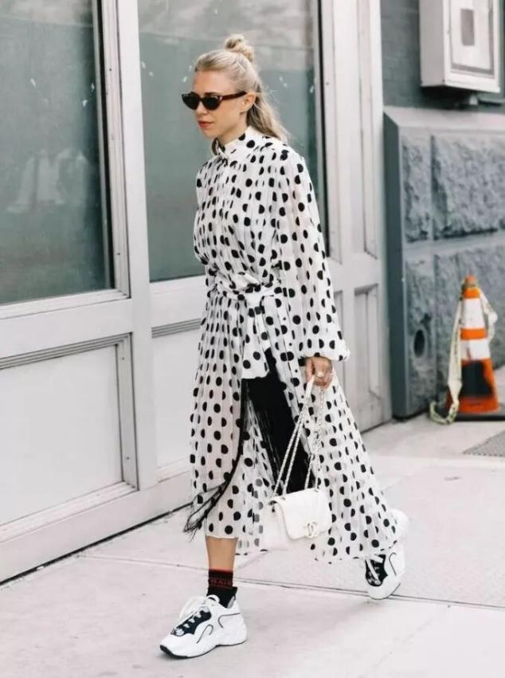

即使搭配粉嫩色系的连衣裙也能平衡得很好，少女感呼之欲出，很难不吸引旁人目光。

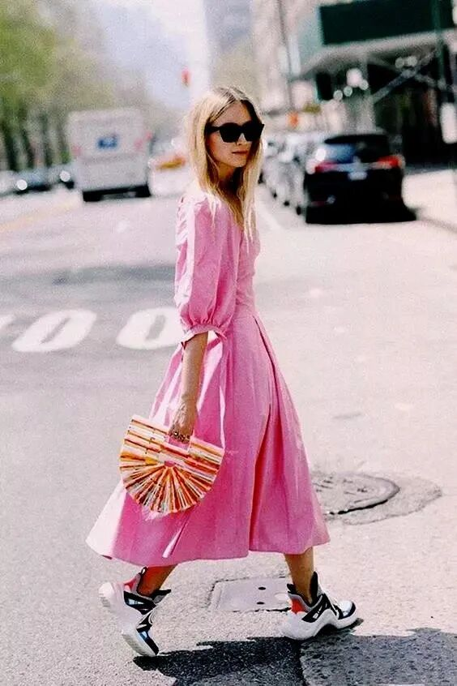

老爹鞋还是妥妥的增高利器，厚底设计自带增高buff，小个子女生可以大胆尝试！

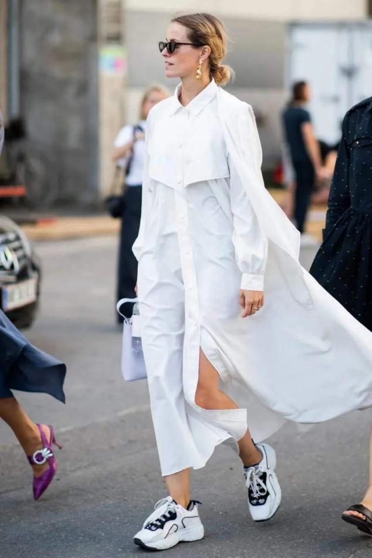

连衣裙+平底凉鞋

接下来的51假期，连衣裙＋平底凉鞋的组合让你在旅途中美得恰到好处，又舒适感爆棚，玩得尽兴~

印花裙是度假最好的选择，方领设计能轻轻松松显瘦，为了不让鞋子抢了衣服的风头，一双卡其色凉鞋就是最好的选择。一字带设计的凉鞋百搭又实穿，搭配一条飘逸长裙，满满的度假风格。

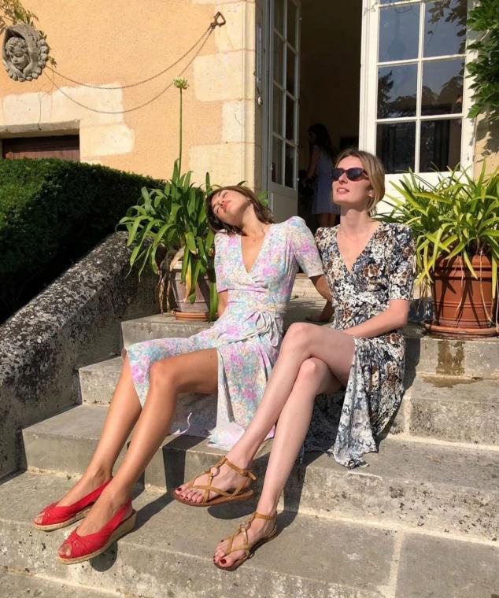

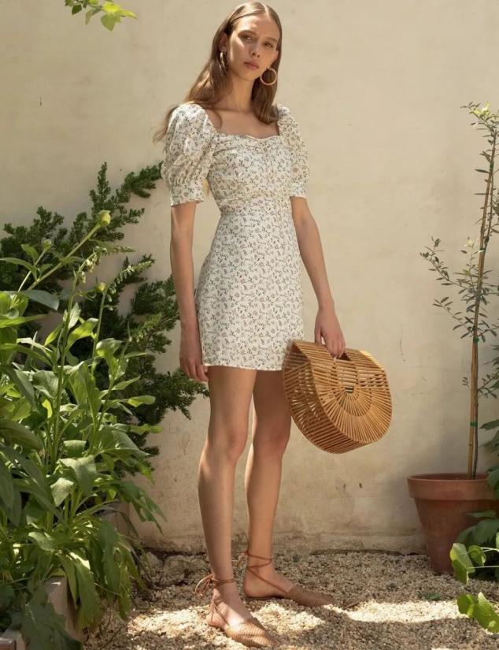

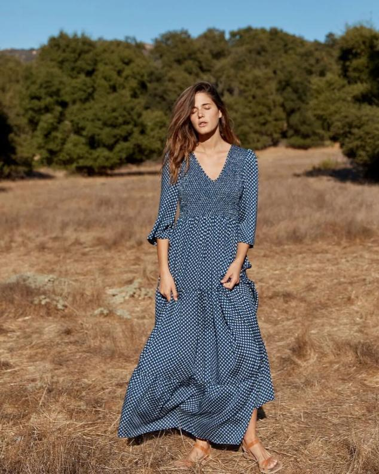

当然也可以选择一些比较有设计感的款式，珍珠坠饰、摆动流苏……这些简简单单的元素透露出时髦小心机，即便搭配最简单的白裙也很nice 。

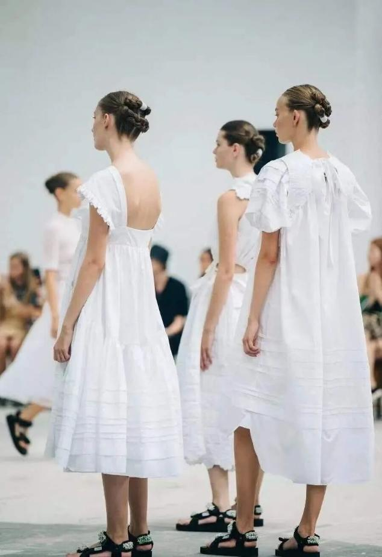

不论什么鞋子，日常可以根据自己的喜好来选，但高跟鞋穿多了容易对脚造成不可逆的影响，这个春夏不如多试试平底鞋，可以带来很多惊喜~
