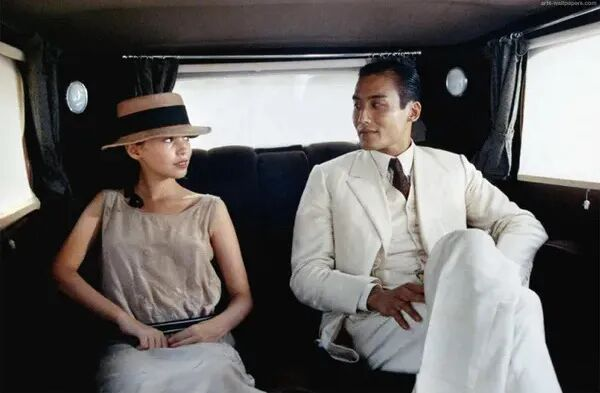
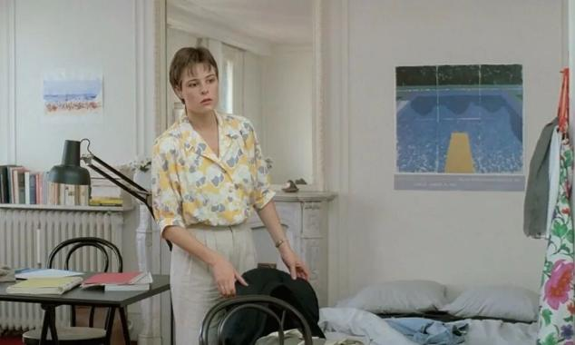
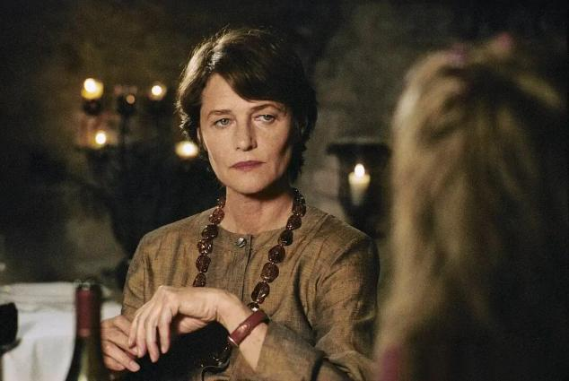
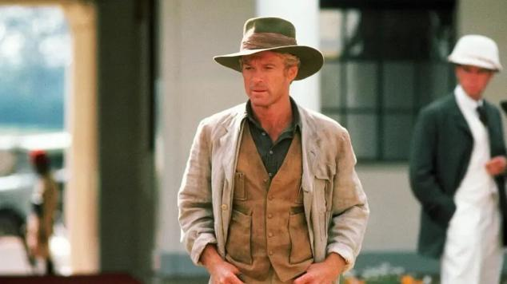
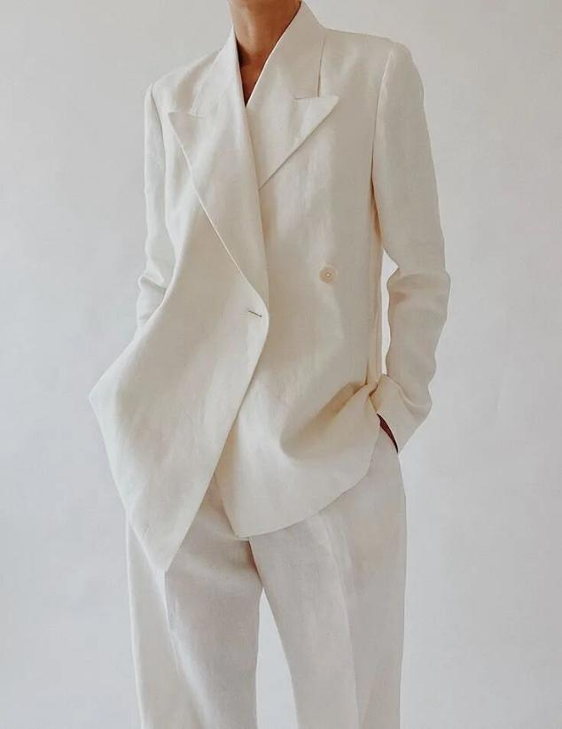
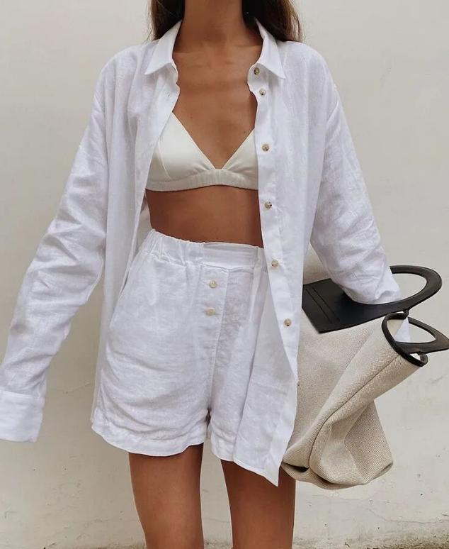
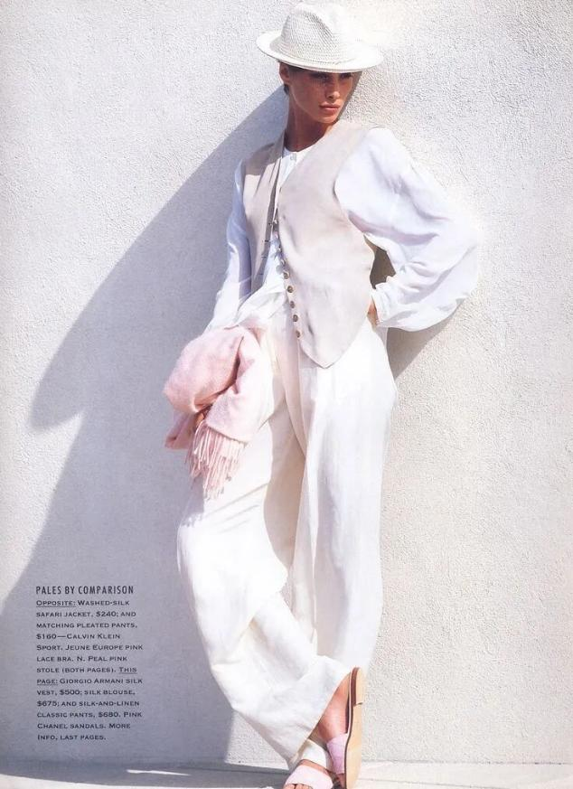
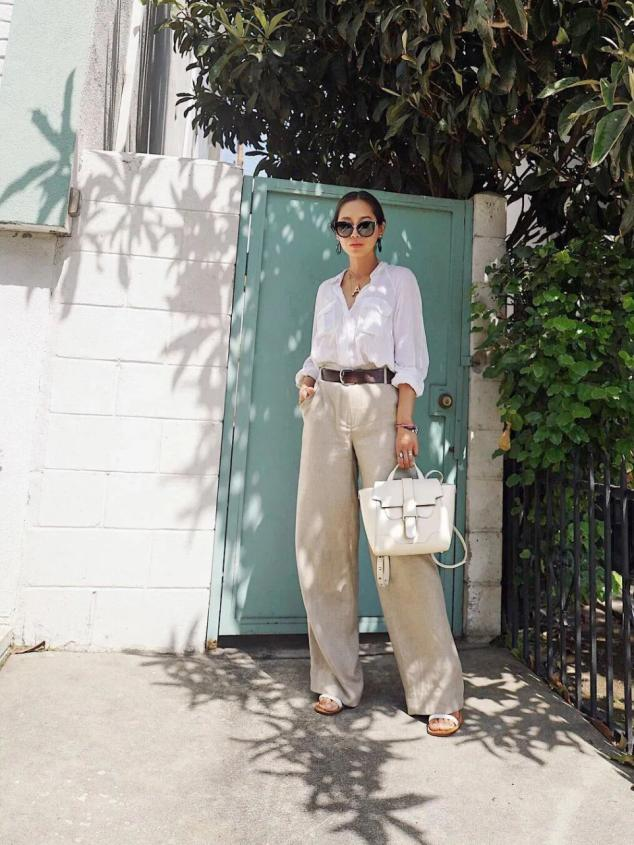
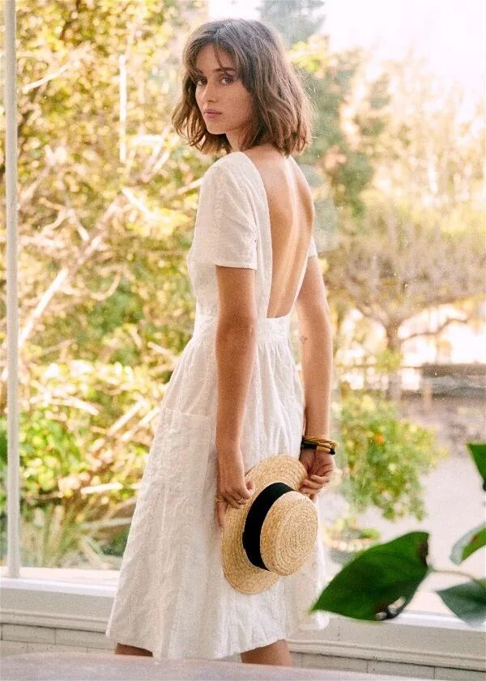

# 文章3：亚麻，就要皱皱的穿！

每年都想要写一写亚麻，特别是夏天，亚麻的疏散透气，是最天然的亲肤材质。

风一吹从透气的空隙进入到服装内部的空间里，微微汗湿的肌肤就像看到了沙漠源泉，那样的清爽透彻。

除了这点，它的美又是那样的独特，皱皱的褶褶的，一点也不挺阔一点也不顺滑。

就好像最不矫揉造作的美人，带着最本真最原始的样子，慵慵懒懒的生活在这个世界上，别人怎样，她是从来不随波的。

穿亚麻是一种讲究。

讲究的不是奢华，而是回归质朴的那份心境，这份心境追求的是高于世俗评判意义上的，某种更高级的未经雕饰的美。

忘了是在哪本书里面看到的，作者曾这样说起亚麻：

这种面料舒适，得体，优雅，自有一番漫不经心和满不在乎的气质，把那些追求一丝不苟外表的人都比了下去。

是啊，皱成那种样子，却能自自在在的穿过热闹的人群，风度怡然的待人接物，这样放旷不修边幅的自信，本身不就是今天我们每个人都想要获得的美么——不费力的美。

电影中的亚麻

法国电影中，亚麻出现的几率要比其他任何地区明显，它更像是法国人天性中对于夏季的热爱。

就像这部著名影片《情人》，相信很多人都看过，改编自法国作家玛格丽特·杜拉斯的自传小说，并由法国导演让·雅克·阿诺执导。

年轻的梁家辉，狭长的丹凤眼自有一股风流气，小麦色的肌肤，配上一身清贵悠闲的白色亚麻套装，更彰显出富家少爷的闲情逸致。

是的，穿亚麻就是要穿出一股不争不抢，不急不徐的闲情，有人说这种闲情尤为高级，其实更准确来说是一股不被生活所迫的悠然。

所以法国导演侯麦指导的《春天的故事》，女主角珍妮所饰演的哲学老师一角，从开篇就穿了一条原色亚麻裤子，配上一条印花衫，悠闲从容富有浪漫气息，地道的法式穿衣哲学。

法国导演弗朗索瓦·欧容执导的犯罪片《泳池情杀案》中，高冷女神夏洛特兰普林，用一身棕色亚麻套装，配原木首饰，将一位女性作家内心的丰富品味，通过亚麻展现的淋漓尽致。

相比法国影片，美洲却将亚麻穿出了另外一种不凡气质，电影《走出非洲》中，男女主人公将亚麻与工装结合，充分赋予了亚麻一种勇敢自由的原野气息。

穿搭中的亚麻

回到现实，其实亚麻在夏季可供选择的单品应有尽有，特别是白色系的亚麻，清爽出尘又松弛，跟西装结合的时候，又有了一份不可多得的从容大气。

也可以选择灰色系的亚麻，内搭一件白色衬衫，这一身别看是男装，但其实是很讲究又尊贵的装扮，适用于任何人借此表达对美和经典的那份坚守。

除了西装，亚麻衬衫俨然也是一个大的品类，透气疏散的布料材质真的非常清凉，搭配一条长裤，可以很好的平衡办公环境所需要的正式和松弛。

夏天穿长裤真是是一种对皮肤的煎熬，但是亚麻却正好，既给了不想露腿的女性一个非常舒适自洽的包容环境，又可以很清爽怡然的度夏。

亦可以选择一条亚麻小白裙，原色或者卡其色也很好，款式可以根据所需环境来选择，想要穿去办公室那么一件亚麻衬衫裙正好，想要穿去约会和游玩，适当的露肤可以令亚麻变得更加新颖。

喜欢穿亚麻，可能是因为能接受那些恰到好处的褶皱，也代表了穿着者的风度、质感和信心。
