# 文章4：阔腿裤 + 凉鞋，穿出成年人独有的松弛感

说到夏天的王炸组合，阔腿裤+凉鞋必须有姓名。

作为职场穿搭来选择也不错，不论是职场新人还是OL女强人都可以驾驭，穿出气场与自信，在各个场合游刃有余~

必备穿搭TIPS

阔腿裤+凉鞋的组合看似简单，其实注重细节会更加分。

👉 鞋裤同色高级满分

同色系有多显高已经不用多说了，鞋裤同色呼应更有一种化繁为简的腔调美感，凸显好品味，真一举两得。

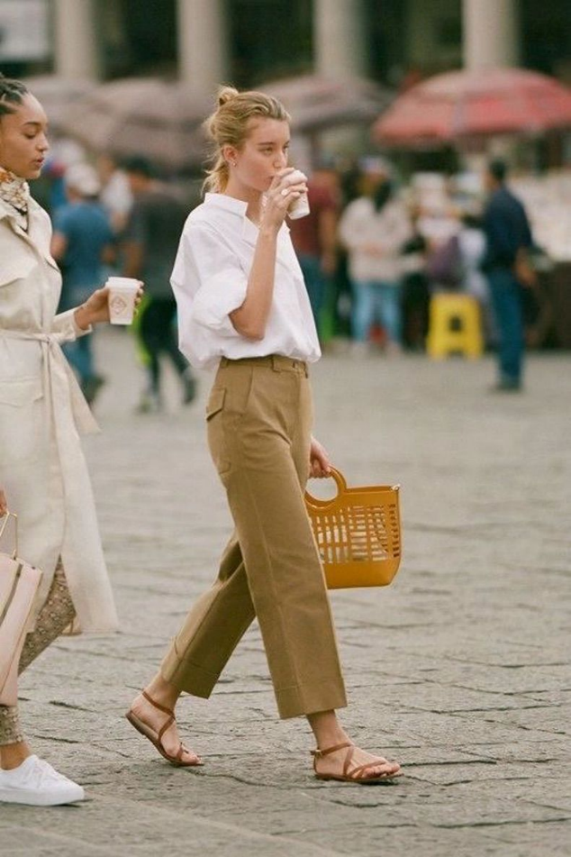

最简单的就是pick黑色系，视觉上得到很好的延伸。

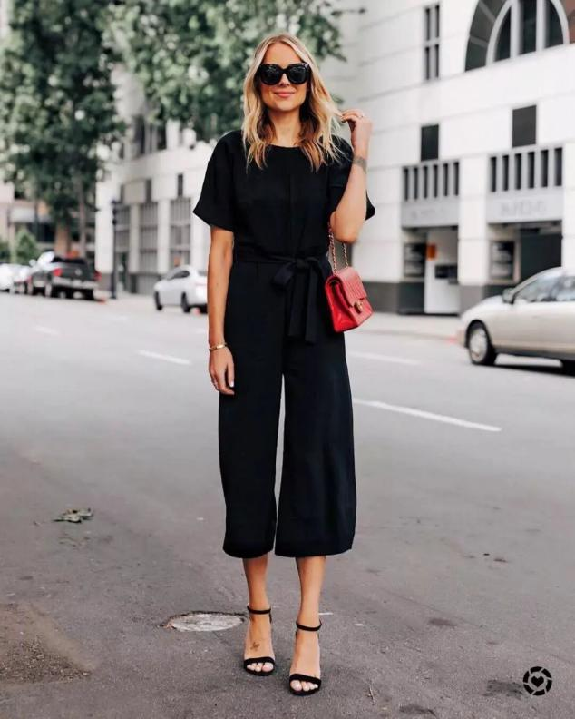

👉 露出脚踝和脚面显高UP

九分和短款的阔腿裤尤其适合小个子星人，露出脚面和细脚踝才是最关键的，下半身纤细轻盈不少，整个人显得高高瘦瘦，总体提升你的魅力值。

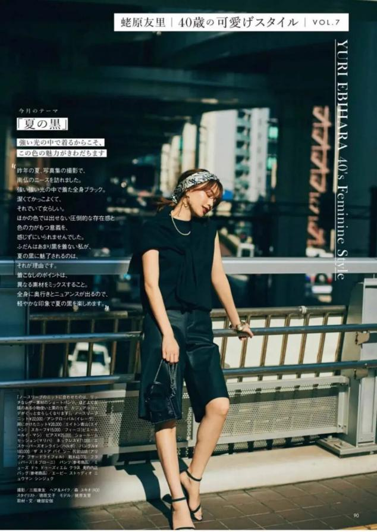

👉 基础色凉鞋百搭首选

基础色是百搭排行的NO.1，当你拿不准该买什么颜色的时候，就选黑白裸，经典耐看永不过时，没有哪款阔腿裤是它hold不住的。

通勤、休闲、甜美等风格，用一双基础色凉鞋就可以做到。

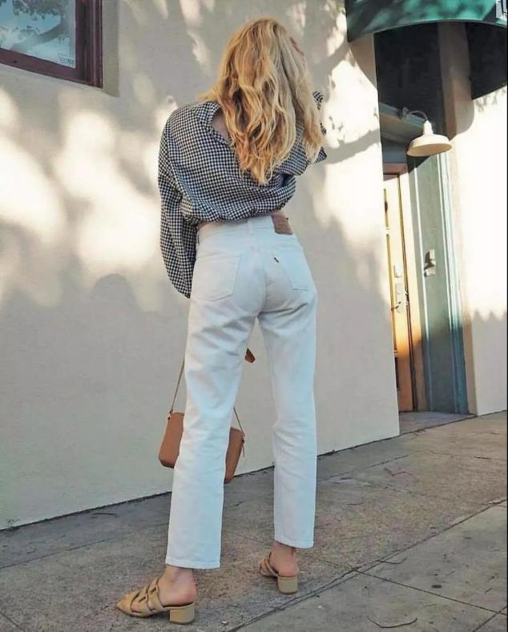

哪个组合更时髦？

不同款式的凉鞋，和阔腿裤搭配都很般配，这个组合不挑身材，能将不完美的腿型加以修饰~

01阔腿裤+一字带凉鞋

一字带凉鞋，作为凉鞋中的经典，总能带来意想不到的时髦感，极简的一字带设计，也能最大程度地露出脚背，腿长一米八轻松get。

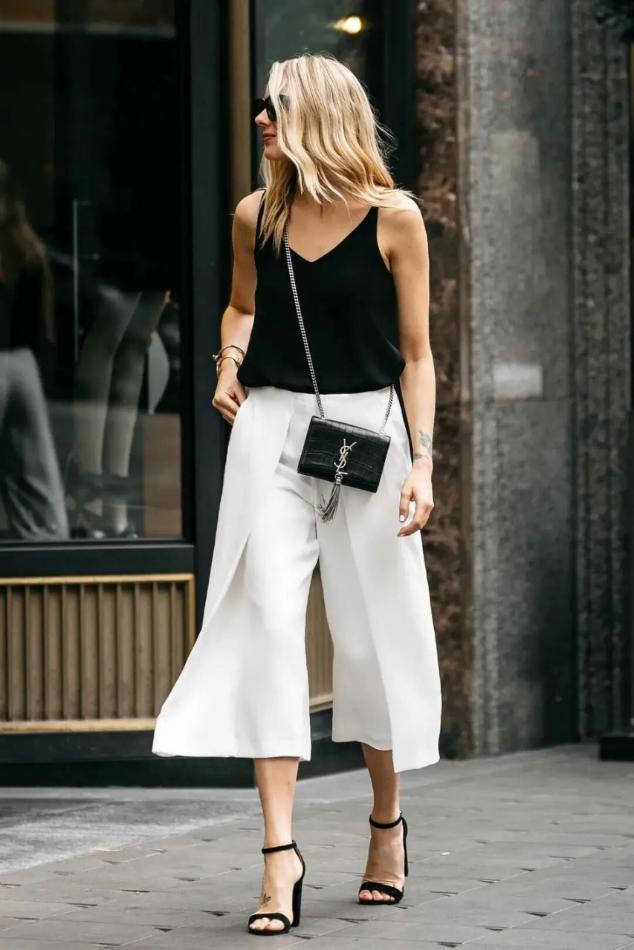

凉鞋带子越宽，脚就越显瘦，所以脚比较宽或胖的集美记得挑选鞋带较宽的款式，可以把脚面最宽的地方遮住，同时修饰脚型。

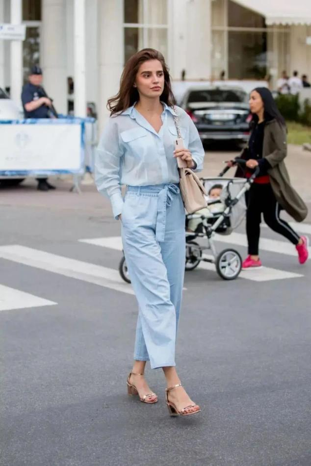

这种在脚面上增加几根线条的款式也很推荐，很有设计感，让整体造型看点满满。

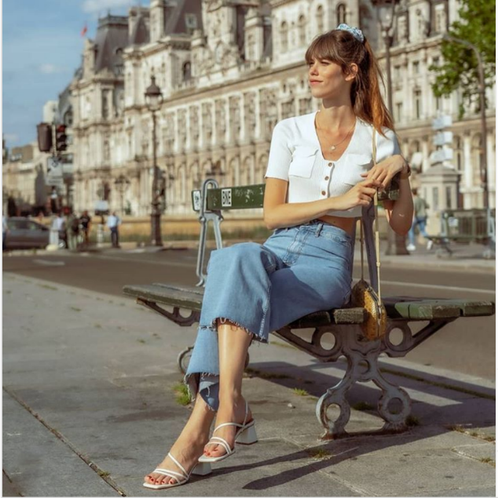

当你穿基础色系阔腿裤时，可以搭配一双亮色凉鞋，视觉上更显眼，起到画龙点睛的加分作用。

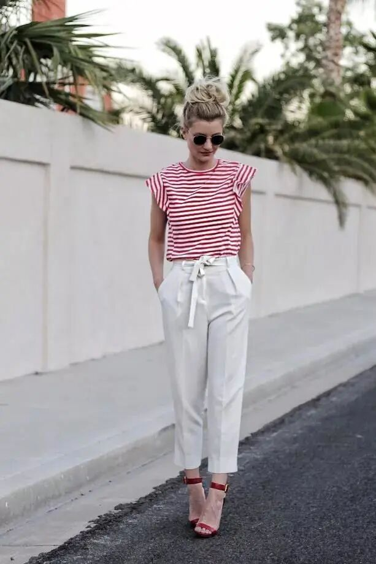

黑色一字带凉鞋搭配条纹阔腿裤，显得大气高级且精致，作为通勤LOOK再适合不过~

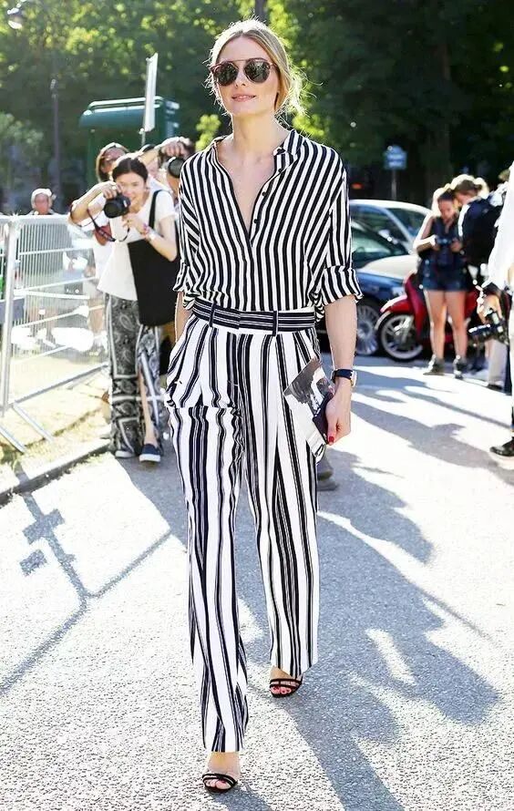

牛仔阔腿裤则不太挑搭配，一件简单T恤、一双百搭凉鞋都可以带来很抢眼的夏日造型，配草编包还有其他的惊喜~

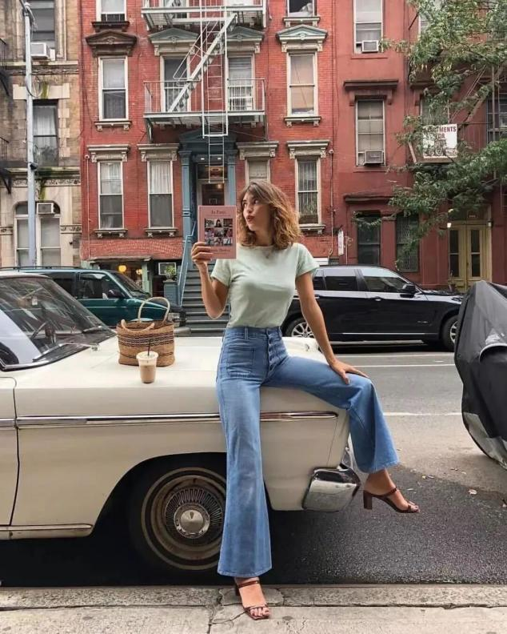

02阔腿裤+绑带凉鞋

当凉鞋加入了绑带元素，交错缠绕之间多了一丝小性感，修饰了小腿线条，和阔腿裤组合让搭配不再单调。

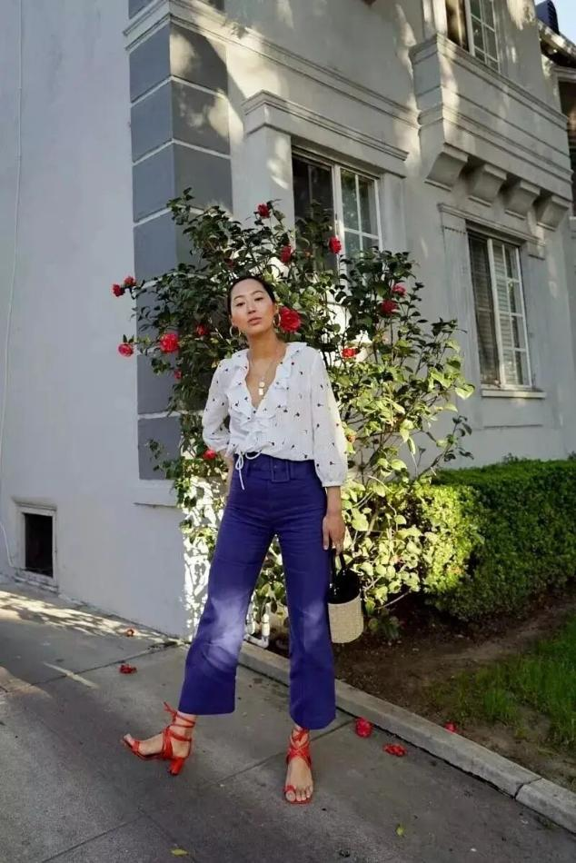

绑带凉鞋和牛仔阔腿裤搭，上衣随意选择，比如最常见的基础款，衬衫、T恤……

舒适和凹造型两不误。

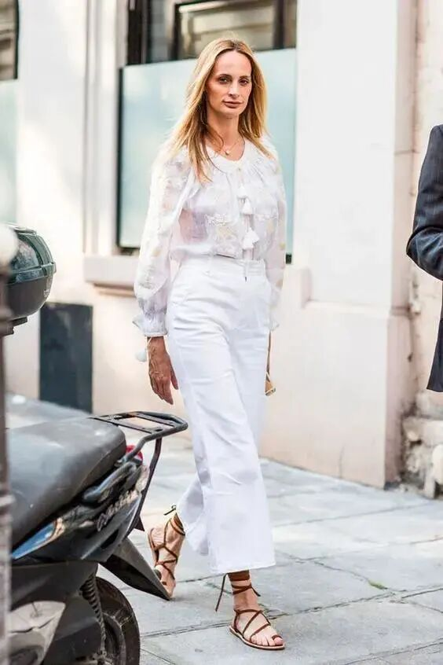

款式的选择上和一字带凉鞋同理，宽脚星人记得选鞋带较粗的款式。

再利用白色+深色带来浅暗色差，便可营造出层次感，即便是平底，一样显高~

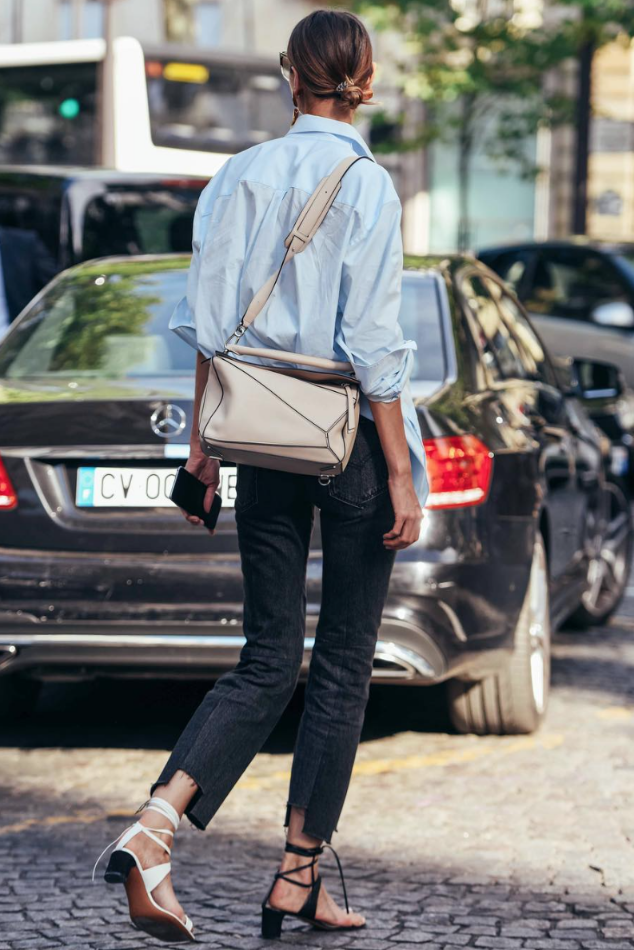

03阔腿裤+凉拖

凉拖是街拍最in利器，夏天pick一双，解放双脚，和束缚感说88。

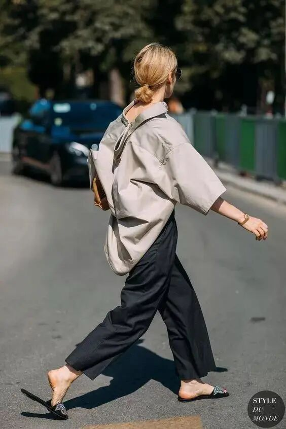

当阔腿裤遇上凉拖，舒适感简直爆棚，不会过于随意，反而有种都市极简风既视感。

尤其是皮质凉拖，咖色系、黑色系很百搭~适合上班穿

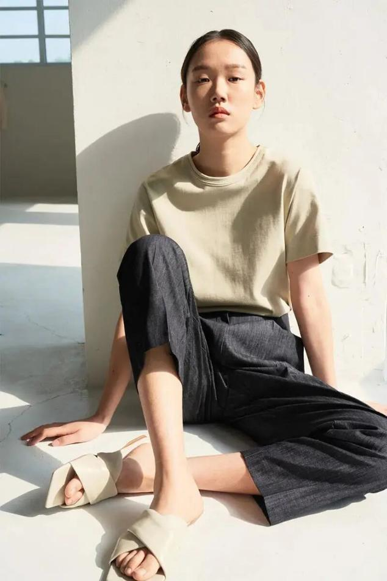

工字拖和牛仔阔腿裤的搭配营造出率性悠闲的夏日氛围，随便搭配一件黑色背心就很好看了。

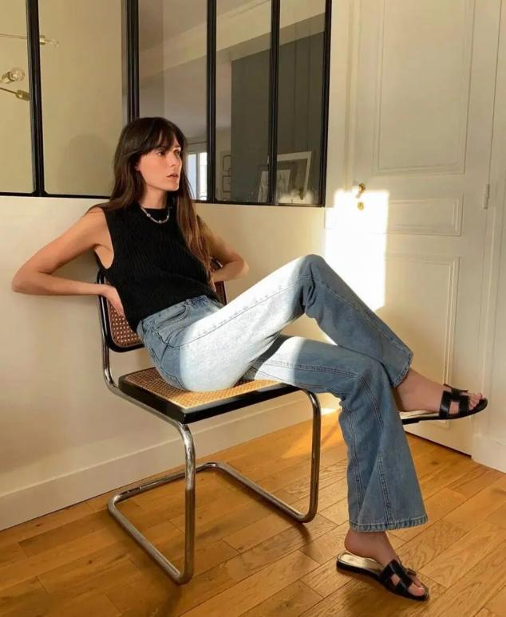

上衣还可以考虑偏中性的衬衫或T恤，一整套真的很有通勤的feel。如果腿短腰粗，阔腿裤记得选高腰款，遮肉！

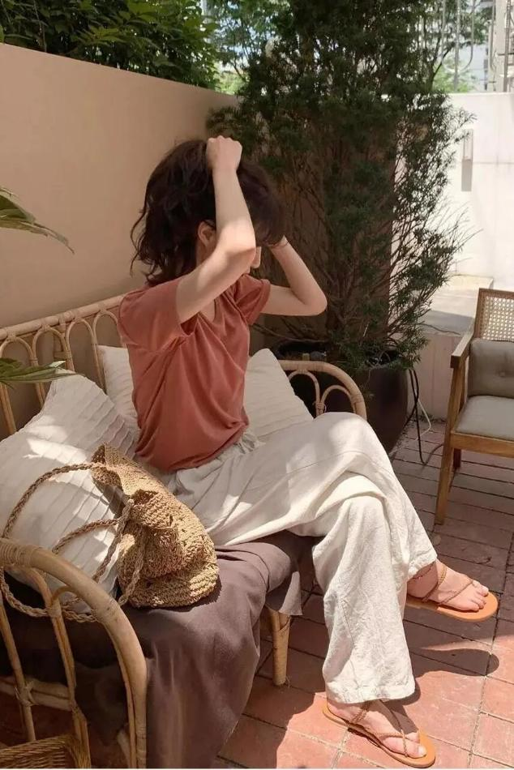

长款阔腿裤搭配简约上衣，造型的整体感更强，裤长就是腿长，还不经意间露出脚踝、鞋尖，为性感加分~

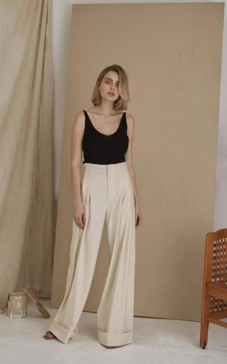

夏天是属于凉鞋的季节，有了阔腿裤的加持，轻松演绎简约干练气质与气场并存的风格，一起穿吧！
