# 文章7：红色，我想穿到60岁，像赫本那样！

女人是需要女人味儿的，但我们总是习惯性的把女人味归结到性感曲线这一栏里，其实不是的，女人味所包含的美是多元广泛的。

可能是远见和博学、也可能是成熟的担当，亦或者是丰饶的姿态，而这其中就包括鲜活的、热情的、明媚的气息和感染力，这也属于女人味范畴。

这样的感染力，一个简单的红色就能搞定，这也是赫本最喜欢的办法。

跟她的其他浅色系穿搭相比，红色的赫本，似乎更加新颖，既有她扎根于骨子里的优雅精致，也有红色所赋予她的艳丽多彩。

所以我们会看到，赫本对于红色的喜爱，曾一直延长到生命力变得不那么茂盛的暮年，却依然可以用一抹深浓的红色长裙。

让松弛和皱纹，突然被明艳动人的气息所感染，在莞尔一笑的瞬间，被赋予年轻的活力和鲜活的魅力。

所以想要让自己显得年轻，一个有生命力的红色是非常好的快速的办法。

这样的红色，一直都是女性生命中不可缺席的重要角色，只是因为这两年极简文化的盛行，黑白色调被赋予了更崇高的属性和意义，却令很多人忽视了红色背后的那份张力以及丰富感。

红色是丰富的，她既可以用简约的剪裁，达到黑白色那样的高级高雅，也能用少量的点缀，为女性带去有张力的美。

它既可以表达明艳夺人的魅力四射，也能在沉静的氛围里只分担优雅的输出。且红色从不设置年龄限制，即便一个女人老了，她还是保有用红色点亮自己的权力，这份权力怎样用都是恰当的。

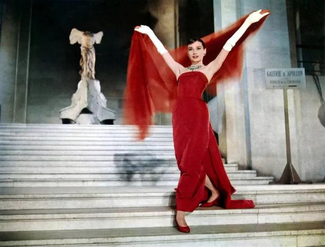

这样的红色，可以说是赫本一生中最挚爱的颜色，从年轻时蓬勃朝气的心，到暮年从容优雅的心态，不同明度的红始终穿插在她的一生当中。

而且她似乎更喜欢正红，参杂了橘调的柿子红、以及酒红这些红调。

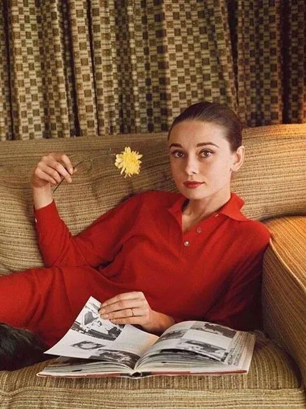

而这三种红色，也是最适合女性的红色，正红色红的大气端正又明艳，酒红色红的神秘低调且撩人，橘红色红的诗意饱满又浪漫。

这样的红调最是适合女性穿搭。它既可以像口红和高跟鞋那样用来提亮女人的一生，但又没有任何轻浮轻薄的气息。

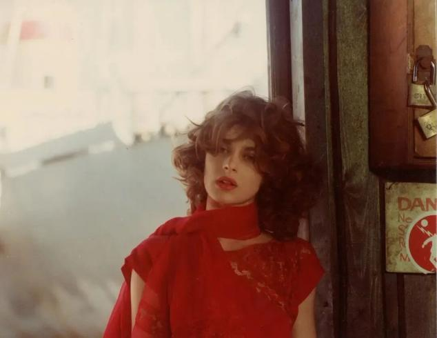

正红色

最适合女性的红

我们总是觉得夏季穿红似乎太热了，最好不要给自己设置这种认知，匆忙的人生一个摇摆，就成了倏忽而过。

而且只要把控好红色跟其他色彩的平衡，红色从来都是最好的配角，比如穿在下身，或者一双红色高跟鞋，保守又明艳。

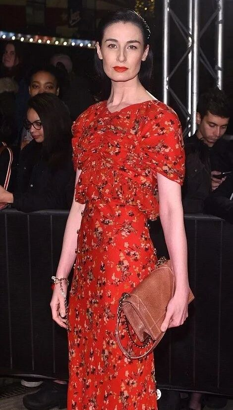

但其实S姐更建议，女性的衣橱一定要有一件红色连衣裙，足够饱满张扬，可以调动女人的心情扶摇而上，穿上就是人群中最鲜明的那一个身影。

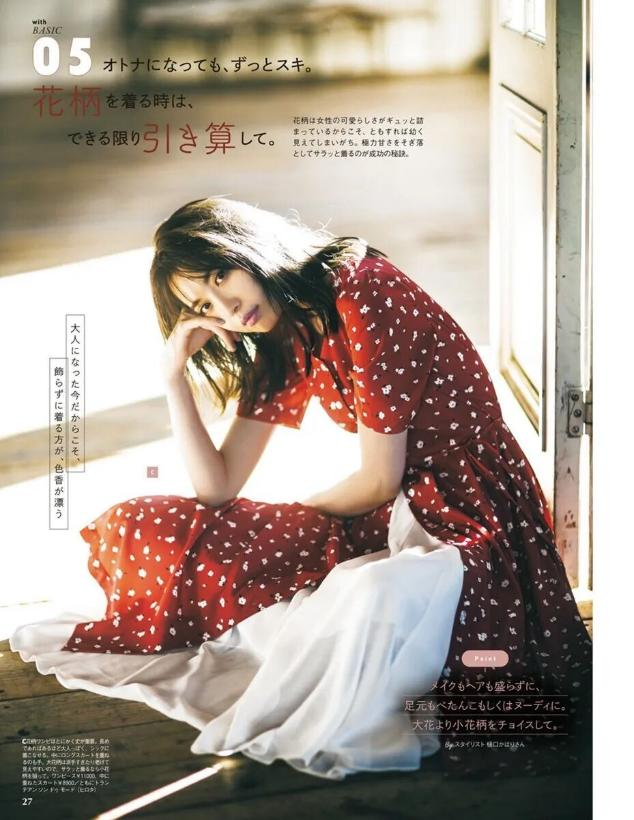

而且夏天的花开的这样好，我们有什么理由，不尽情绽放一次美的频率呢？特别是法式感的小碎花连衣裙，小碎花可以降解红色的野，变得文艺起来。

也可以是一件正红色开衫，在夏季空调房，随便搭配一条半身裙，就很有经典法式味道。

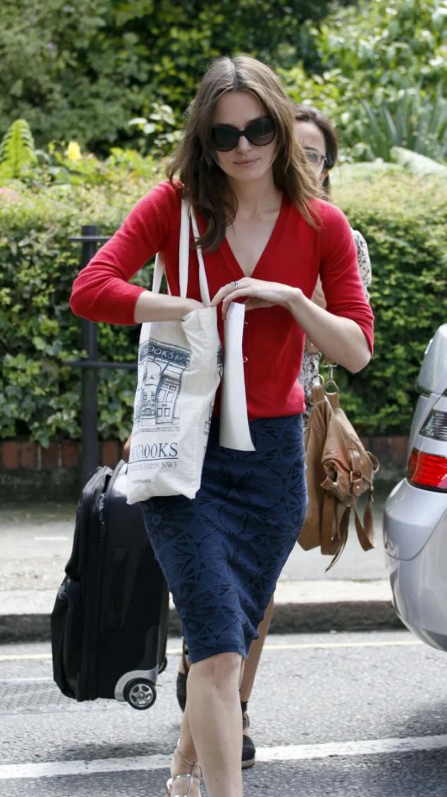

酒红色

最适合女性的红

或者也可以选择色调暗一点的酒红色，除了碎花，波点也是经典的花纹风格，一点点俏皮的小女孩气息，可以令酒红色的轻熟，突然变得柔缓起来。

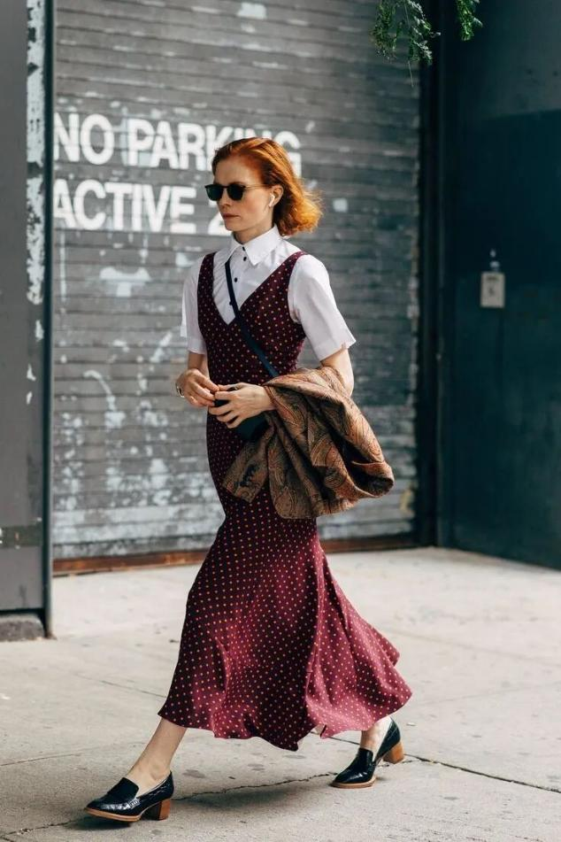

在挑选不同饱和度的酒红色时，可以根据自己的肤色来，如果是黄皮，可以选择稍微带一些橘调的酒红棕色，如果是冷白皮，那么紫红调的深浓酒红色，更有冷艳奇情的惊艳魅力。

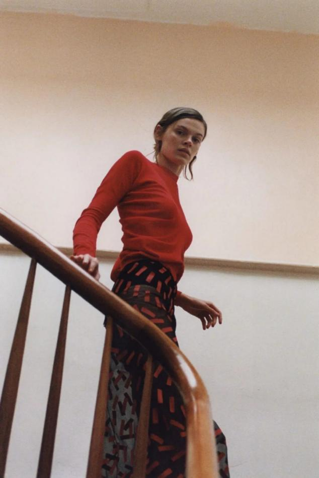

柿子红

最适合女性的红

当然如喜欢张扬一点的，稍微带些橘调的柿子红更加饱满热情，同时还具有秋天的诗意和丰饶。

特别是这种红调跟绿色组合成的印花裙，一定是衣橱战袍一样的存在，你总会需要在夏日聚会的某天，穿上这样的裙子，无所顾忌的美一次。

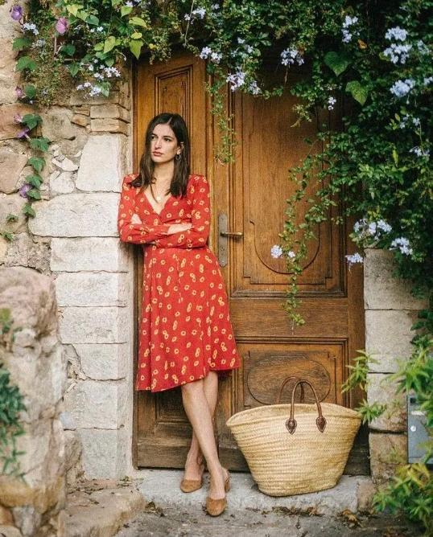

如果不想红色占比重太多，那么一些带有红调的印花衬衫，也是夏季很多人的选择，风格可浓情、可清新、可时髦，只要下身穿一条净版白裤子，一切似乎都非常合理了。

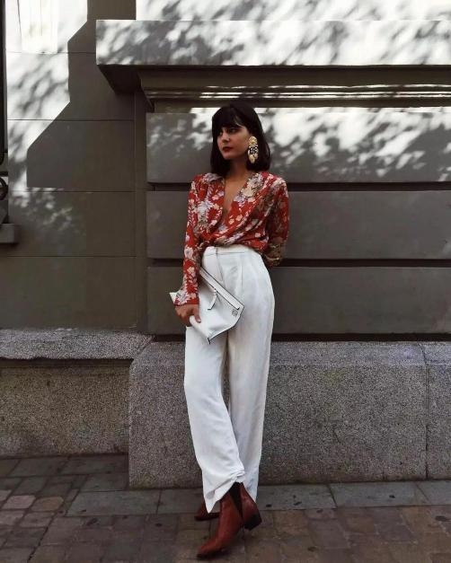

也可以是半身款式，一件T恤或者一条裙子裤子，担心肤色问题可以把红穿在下身，如果无惧任何颜色，那么一件做旧红调T恤，其实更耐看。

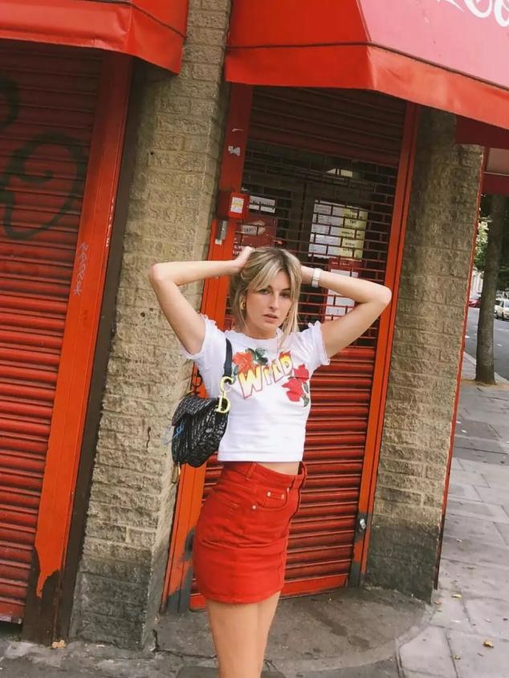

也可以把红调的比重降到最小，一条张扬的耳环、一双明艳的凉鞋，或者一件内搭T恤，只要用对了地方，小反而才能成为整体的点睛之笔。

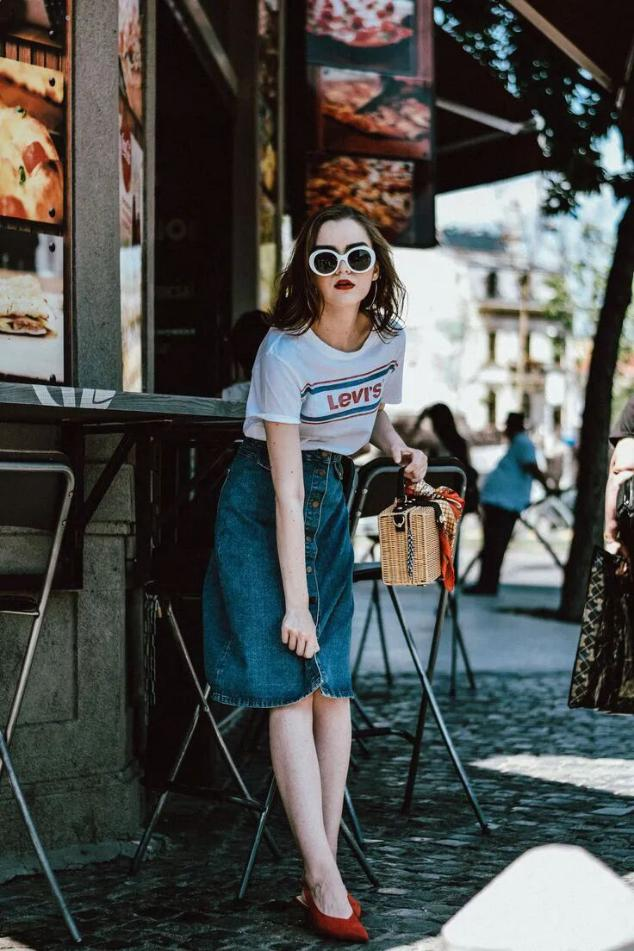

赫本，暮年的一场晚会上穿最鲜艳浓郁的红来点亮自己，那样鲜活那样从容，明艳到极致反而很沉静，热烈成那样却无损她的高贵和优雅，所以想要穿好红色，请给予它一颗足够丰富坦荡的心。
