# 文章8：你的高级感，烟管裤轻松搞定！

“什么衣服能穿出高级感”？

“怎么穿才显得有高级感”？

尤其对于OL职场人士，“高级感”一定不能少，TA不仅仅是一个代名词，更是站在职场中的态度，TA是一种稳定端庄、是靠谱大气，也是我们自身的名片。

有人说高级感是一种克制的、极致的、特立独行的。

说到克制，德国工业设计师Dieter Rams，他的“设计十戒”中有提到“好的设计是尽可能的无设计”，体现出简洁、克制的重要性。

所谓极致的，就是对细节的极度追求。而特立独行便是“不随波逐流”，有独立的思考，有自信的人格魅力，这不仅是高级感的体现，也是OL职场人的职业素养。

正如“烟管裤”，简约干练的线条，搭配上宽下窄的修饰性，斜插口袋的细节设计方便穿着者解锁无处安放的双手，轻松穿出高级时髦的气场。

衬衫+烟管裤

衬衫混搭烟管裤，Hold的日常和通勤的神仙高级CP，衬衫的优雅搭配烟管裤的干练利落，每年夏天必入。

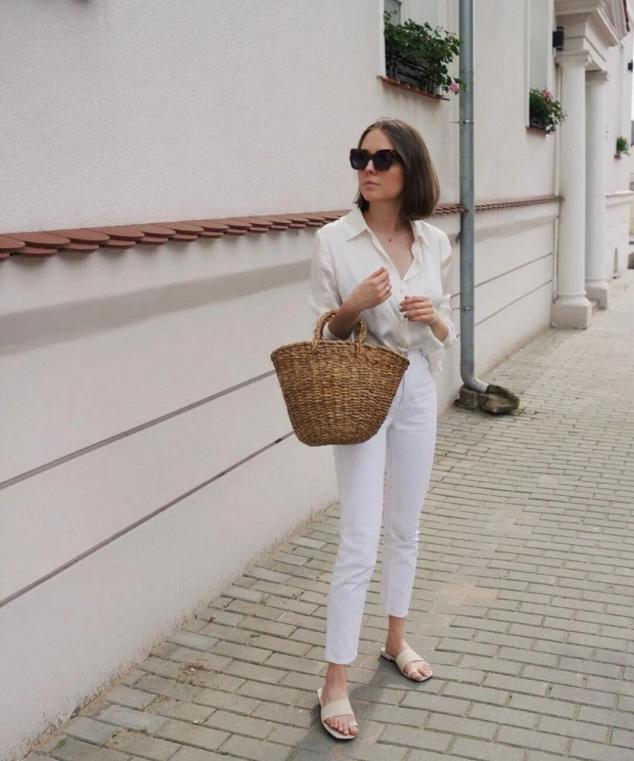

尤其是OL职场达人，衬衫的正式感能够在视觉上提高专业度和业务水平，搭配烟管裤相比西裤更加修饰身形，弱化衬衫的严肃感增加时髦感。▲

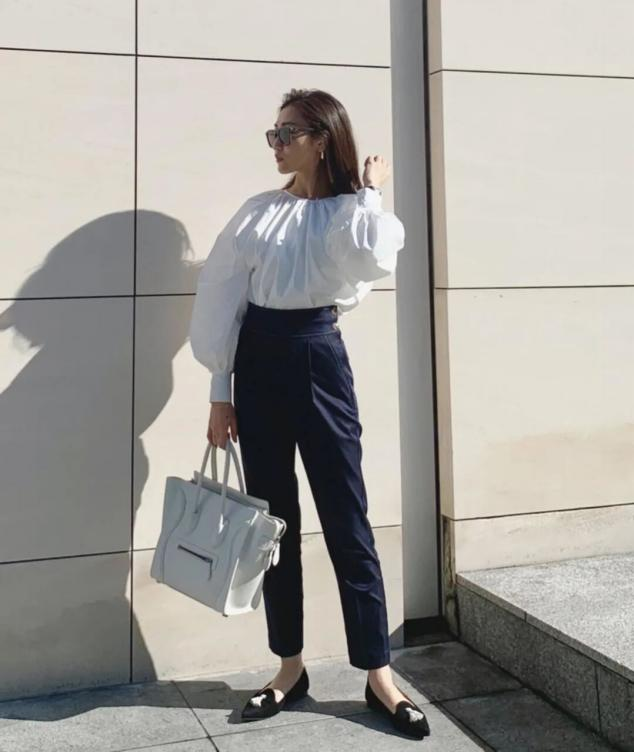

经典的高级配色显得整个人利落有型，气质也是UP UP，烟管裤上宽下窄的裤型对梨形身材、胯大的美眉极度友好，完美的修饰身材。上身黑白强烈的对比色时，衬衫要掖进裤子里，腿长和气场双倍提高。▲

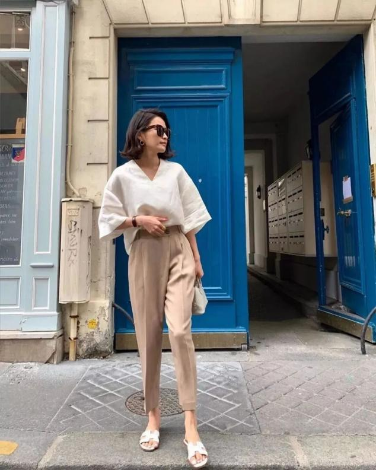

温柔的奶咖色搭配白色，整个人的气场都会变得温婉知性，没有距离感和攻击性。当然，奶咖色系的简约得体也是职场星人必备的色，亲近和高级的feel更容易和职场伙伴打成一片。▲

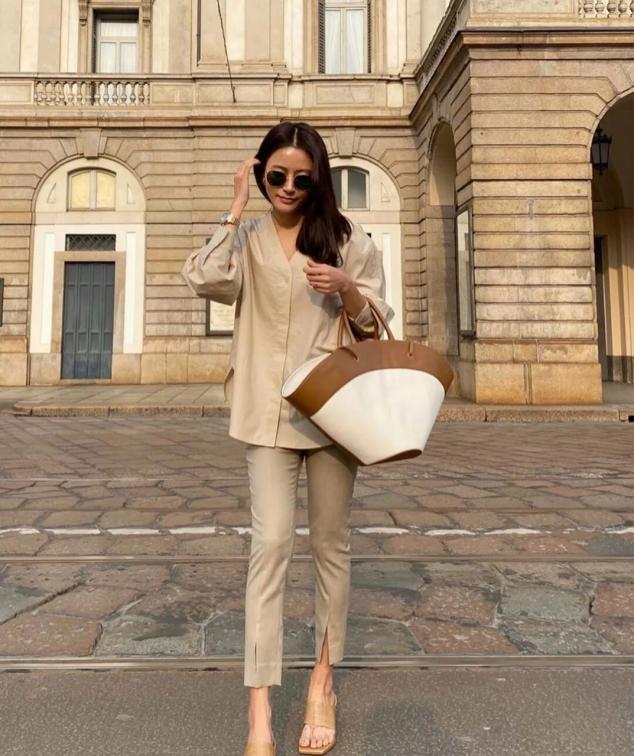

奶咖色自带暖光黄系的属性，相比更适合冷白皮的仙女穿，如果是肤色非常暗黄没有光泽，这款色系就不要考虑了。▲

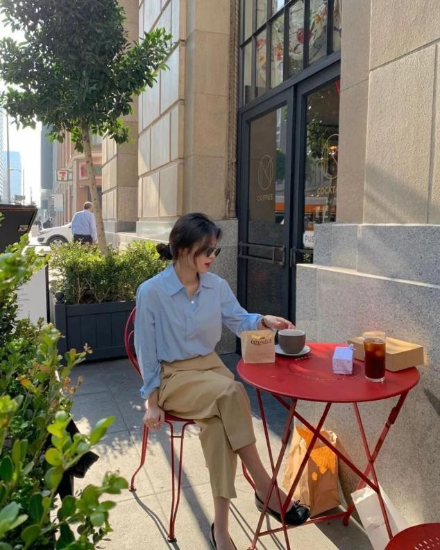

肤色暗黄星人雾霾蓝强推，也是火爆高级的色系，它比普通蓝更加沉稳知性，灰色调的蓝色增加温柔的同时，也会映衬出嫩白有光泽的肤色。▲

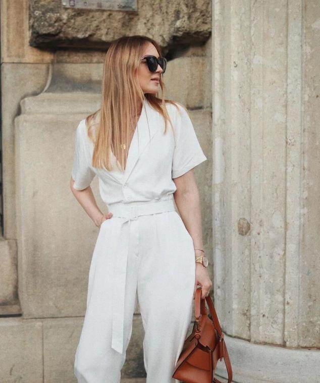

不论什么颜色搭配在一起，同色系永远都高级时髦的，递进式的白色或是all white，都自带女强人的既视感，如果通勤不知道穿什么，这样搭配保证不会出错。▲

T恤+烟管裤

相比衬衫，T恤更加的休闲随性，和烟管裤搭配，打破了它的严肃感和正式感，使整个人都是一个比较放松的状态，职场达人穿还能减龄~

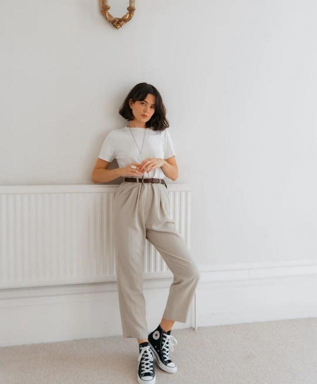

米驼色烟管裤相比白色更加成淡雅轻熟，带有浓厚的复古气息，搭配灰度较高的T恤，十足的日系风，带来别致的高级感。▲

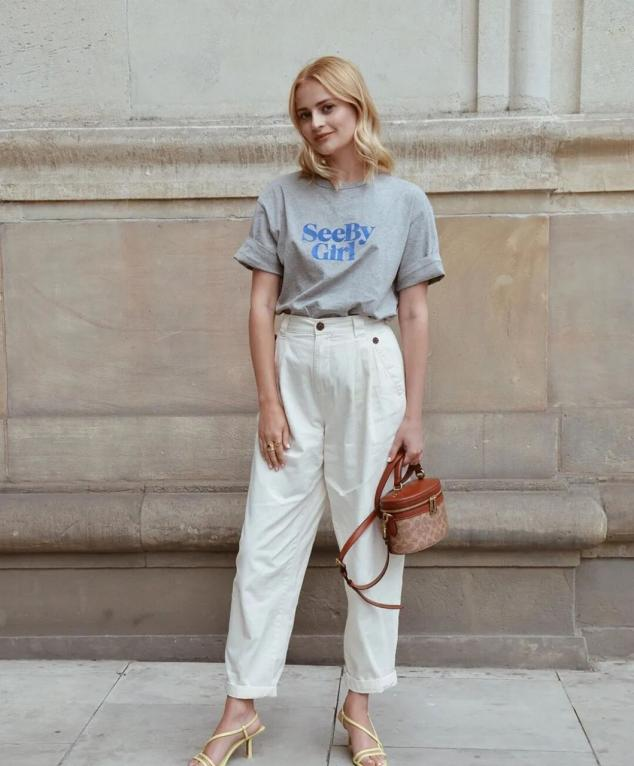

灰色T+白色烟管裤，干净又高级，夏天穿搭配一双绑带高跟鞋，也是妥妥的显腿长，上半身臃肿的美眉选择宽松T，视觉上有一种弱化臃肿的对比感，袖口卷起来的小心思照样流行，小小的细节大大的效果，露出纤细手臂就靠它了。▲

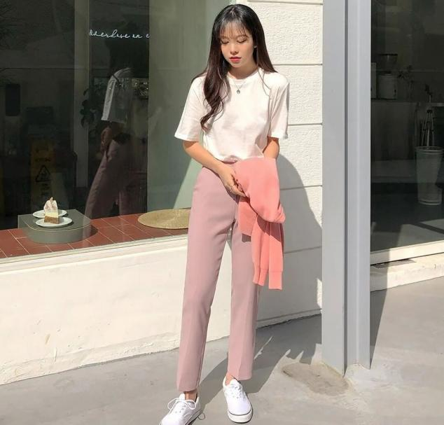

女生无论多少岁，都喜欢被夸赞有少女感。藕粉色是莫兰迪色系的一种，高级且温柔，减龄力也相当max，搭配简单白T，清新活力的少女一枚，通勤这样穿，绝批吸睛。▲

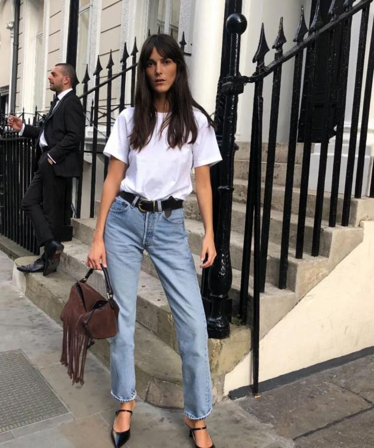

牛仔烟管裤+白T，小个子的美眉这样穿，视觉上腿长2米，气场2米8，T恤掖进裤子里，再系上一条个性腰带，就是高级icon。▲

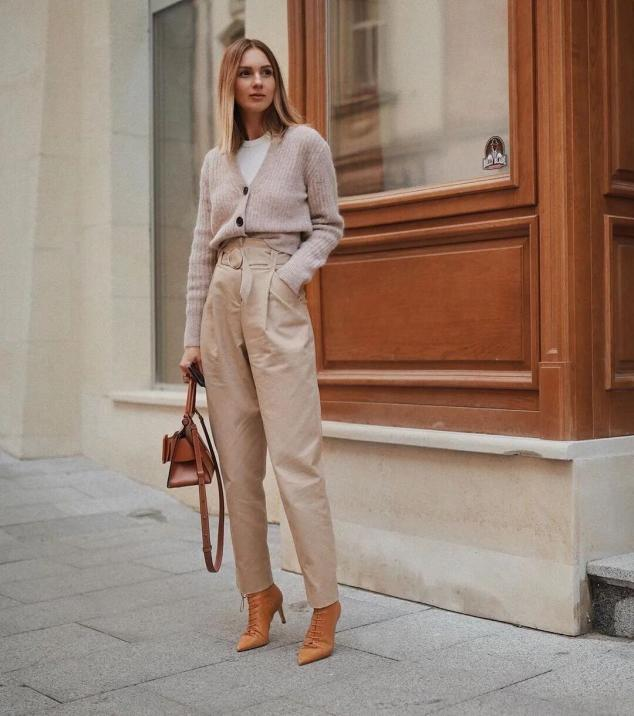

夏天来了，但办公室空调温差还是有的，一件针织开衫或是帅气西装，既保暖又时髦，个性温柔的美眉选择针织开衫搭配T恤+烟管裤，气场全开的女强人就选择西装搭配T恤+烟管裤。▲

西装+烟管裤

西装热潮一直都没退下去，S姐觉得就算是到了盛夏，西装依旧是时髦高级的必备单品，西装和烟管裤就像是天生CP，它们之间碰撞出来的就是时髦高级感，穿就完事了！

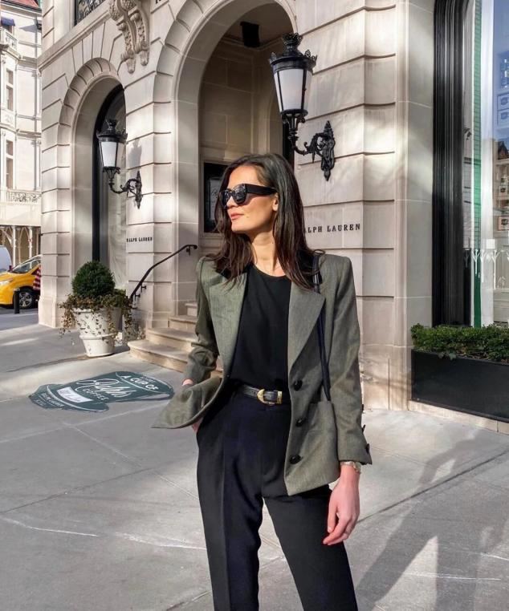

西装+烟管裤，搭配深色系内搭，明显的腰线一定不能少，可以加一根腰带或是把内搭掖进裤子里，整体LOOK不仅帅气干练，高级感和时髦度也是一路飙升。▲

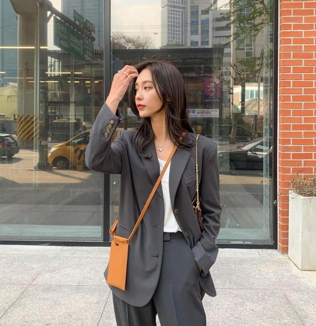

搭配浅色系打底，通勤穿建议直接搭配白色，精致又干练，西装外套不论是oversize款或是修身款，都能给人一种张弛有度的利落和高级。▲

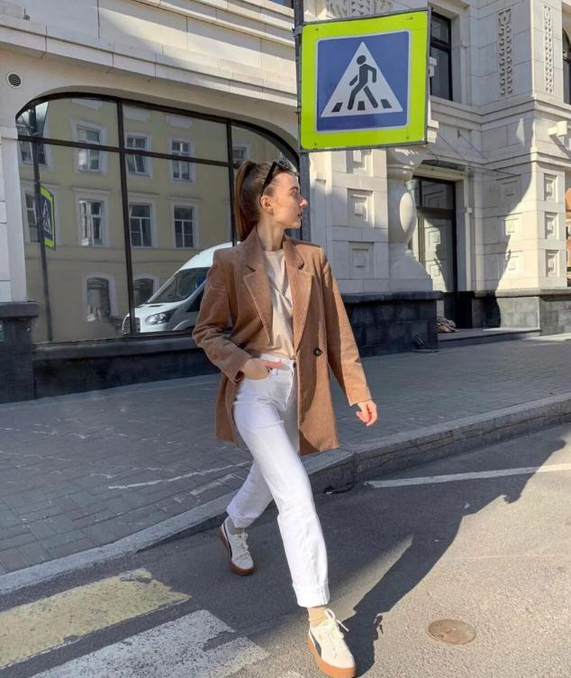

白色烟管裤搭配西装，自带减龄法式风情，它是集优雅高级和清新少女于一身的LOOK，对身材也是有很好的包容性，内搭衬衫，营造通勤风；内搭T恤，休闲率性。▲

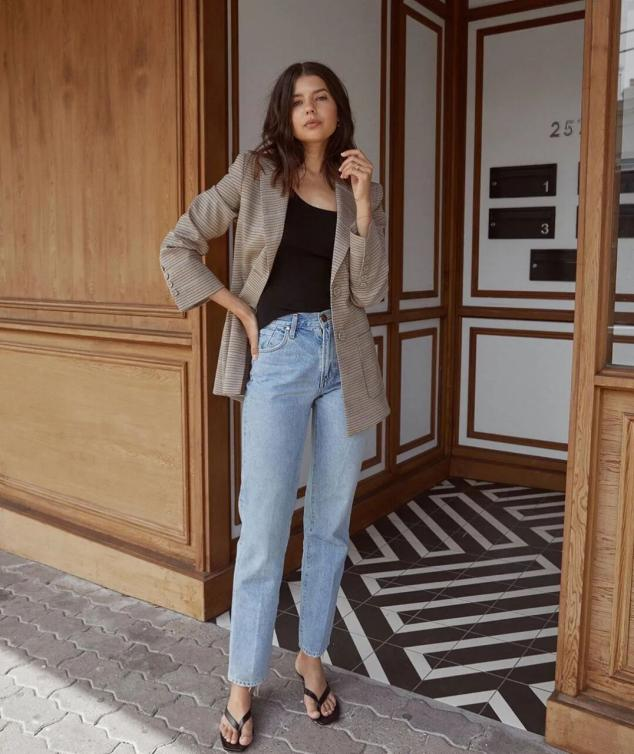

牛仔烟管裤+西装相比直筒裤更显瘦更能修饰腿型，裤腿微微收口呈现倒锥型，视觉上有收缩感，而西装的长度刚好又可以遮住胯部，把不完美藏得严严实实。▲

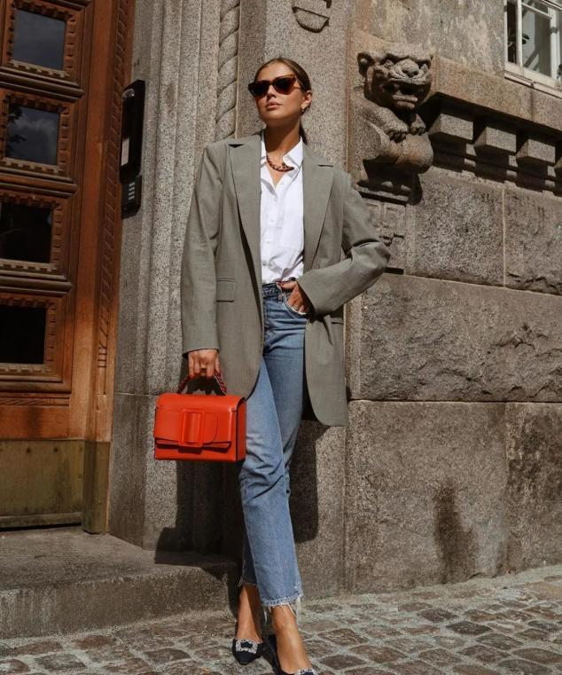

牛仔烟管裤的休闲帅气搭配西装的复古硬挺，内搭衬衫的严肃高级，这套混搭风太吸睛了，通勤这样穿，妥妥的时髦精。▲

烟管裤的“高级感”，让人无法拒绝。
