# 文章9：穿粉色，就是初夏最美的样子

是的，就是粉色。

这种极致浪漫化的颜色，可以轻松转变外在环境的氛围，让人不自觉沉浸在美好的柔软里，因为没有任何攻击性，所以总是很容易获取好感。

外加上，粉色还可以很好的起到红润肤色的作用，女人的好气色是一切美的来源，这也是粉色不自觉自带美人氛围的来源。

它既可以典雅贵气，也可以摩登时髦。

亦可以风情无限、甜蜜俏丽……

粉色怎么选？

很多黄皮女孩不知道该怎么选粉色，其实很简单，只要避免高亮荧光的深粉和玫粉。

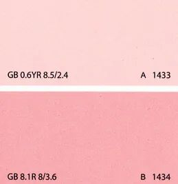

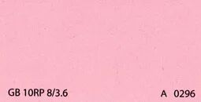

选白调居多的淡粉、水粉、樱花粉、豆沙粉就好。

这几种粉调清新干净、饱和度温柔，不管什么肤色穿都好看。

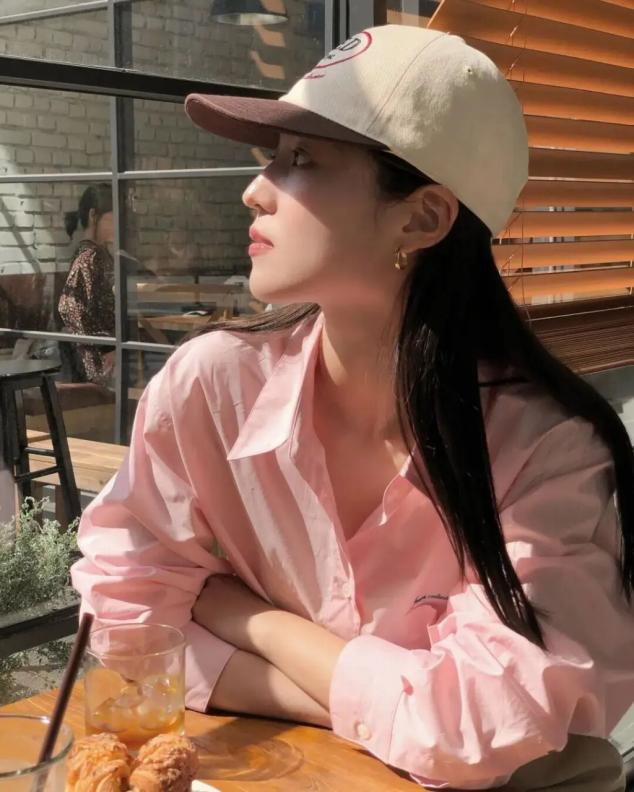

粉色衬衫

粉色衬衫实在是太流行了，几乎到了人手一件的程度，对于穿腻了黑白蓝的通勤女孩来说，不如换一件粉色，调剂一下心情。

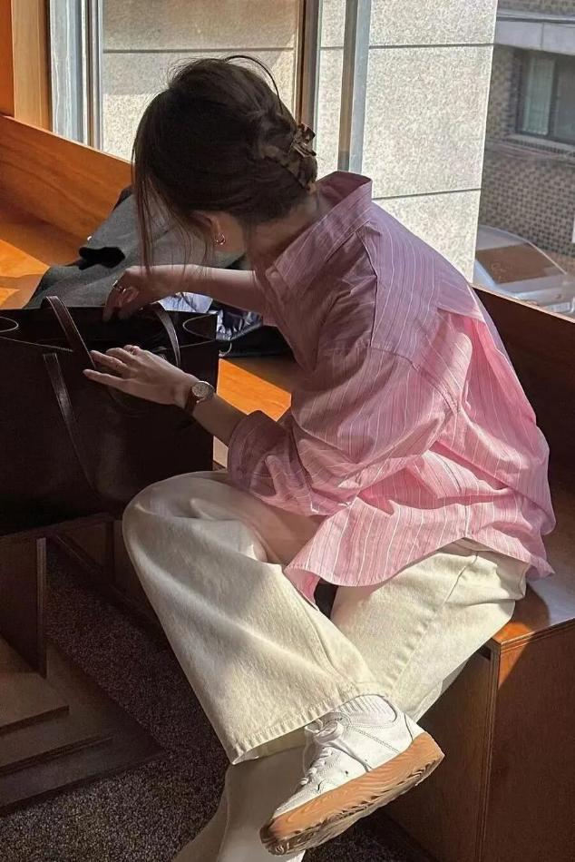

在搭配上，简单干净的白裤子就非常适合，可以稀释粉色的饱和度，让粉色变得更加透亮温柔。

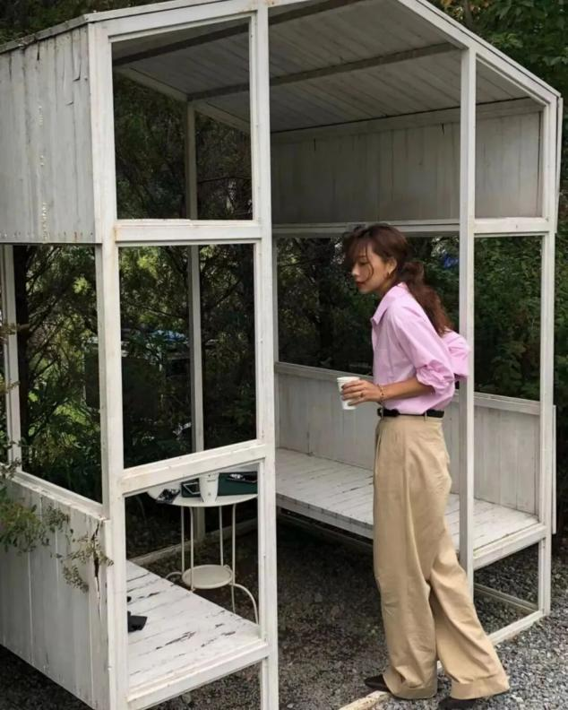

或者一条卡其裤也不错，卡其裤的温和气质，正好跟温柔的粉色相近，又能令粉色凸显一部分成熟的品质。

也可以把卡其裤，换成浅色调的奶油黄裤子，跟水粉色衬衫搭在一起时，就很舒服养眼。

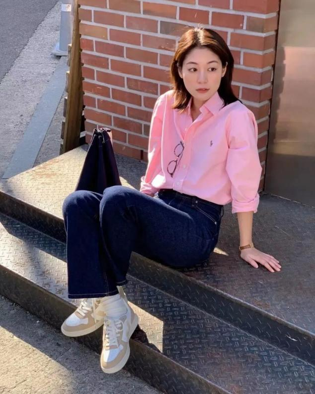

粉色衬衫的众多选择里，离不开牛仔裤的出场，但在搭配时注意。

若是深一点的蓝粉色，可以用藏蓝色日式牛仔来平衡，同是深色调，视觉上格外和谐。

而浅蓝色的牛仔裤或牛仔裙，更适合跟白调多的浅粉色搭在一起。

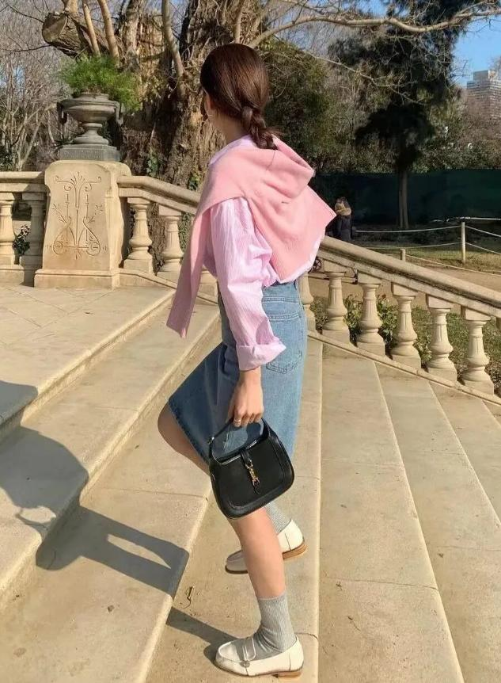

粉色裤子

其实很多人忽视了彩色下装的优势，因为远离脸部，即便明艳一点也不怕，还能让基础款轻松脱颖而出。

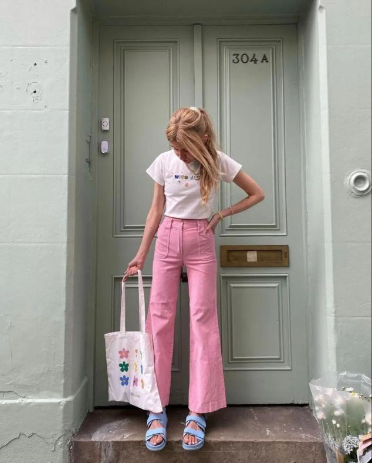

就拿粉色裤子来说，裤装的利落和理性自动成熟化一部分粉色的不切实际，比起粉色上衣，粉色裤装更温和成熟一些。

日常随便搭配一件白T恤，就很出挑。

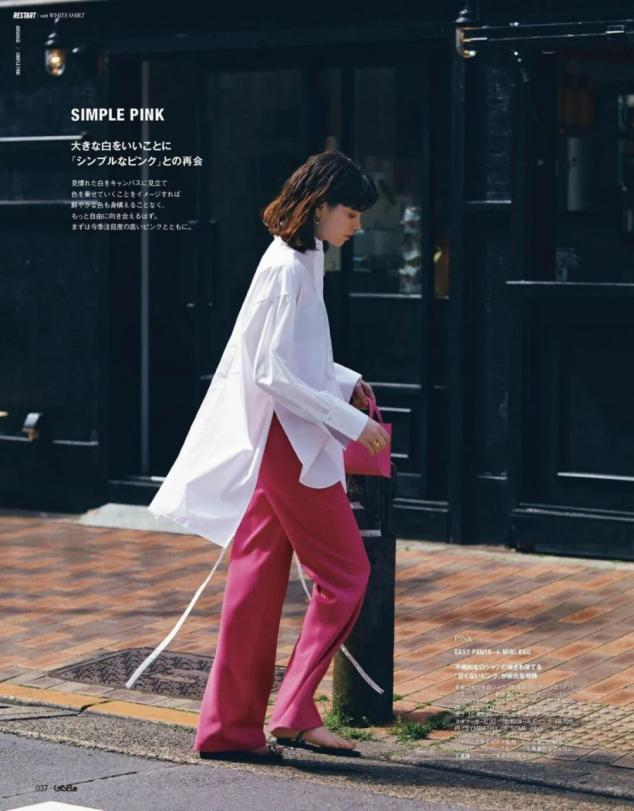

所以上装的选择以基础款为主，比如一件oversize款白衬衫，又温柔又洒脱。

也可以是一件法式浪漫小衫，跟粉色裤子的风格相近，是很甜美的一套装扮。

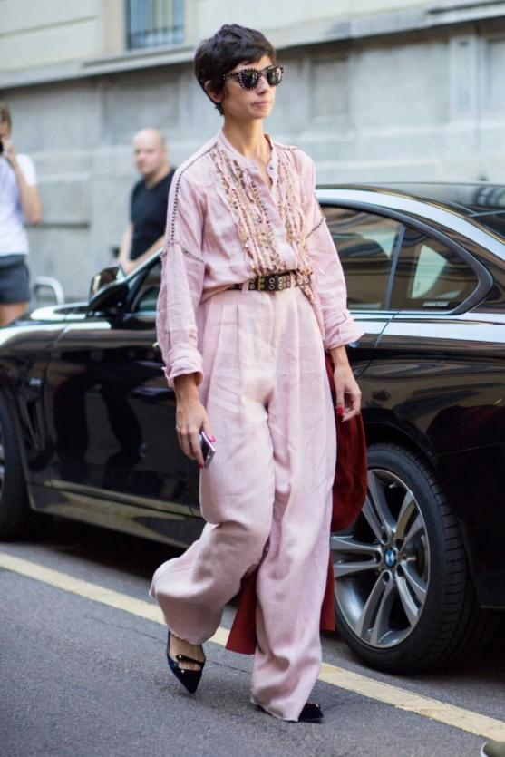

也可以走同色系路线，但大面积的粉最好选低饱和度，比如淡粉色套装，格外淡雅脱俗。

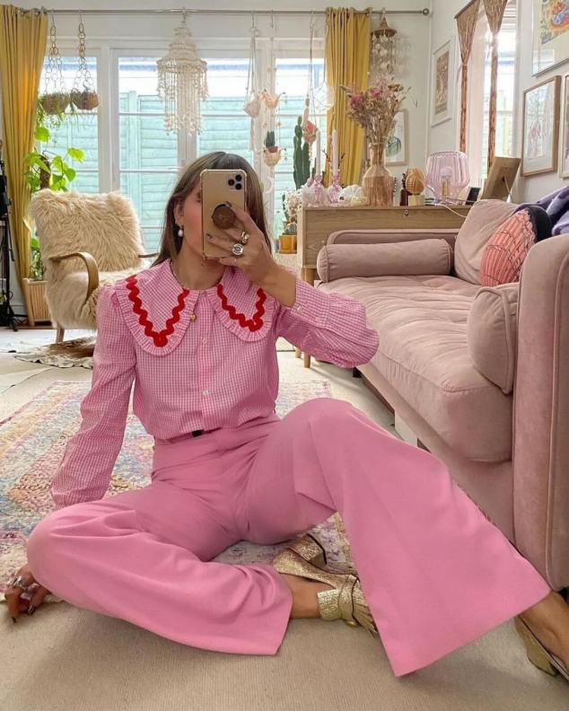

若不考虑饱和度的高低，其实橡皮粉也很好看，非常适合走复古混搭风。

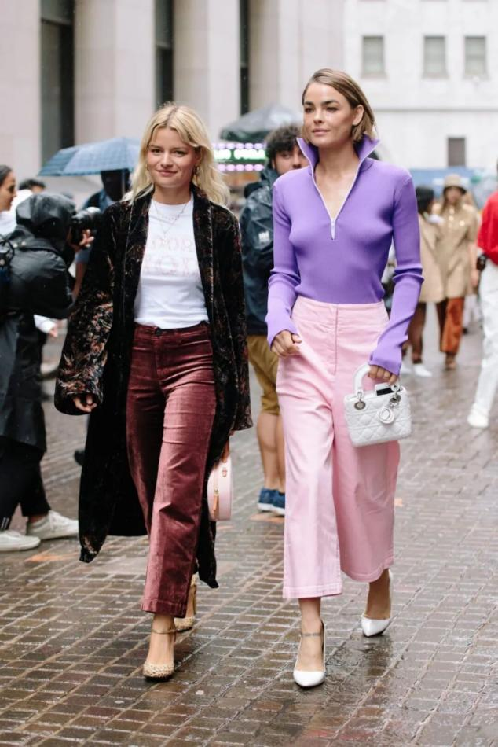

或者搭配其他彩色上衣，蓝色和紫色都是粉色的相邻色，搭配在一起往往很和谐。

粉色裙子

作为接下来日常穿搭的主角，裙装的选择就变得很重要。

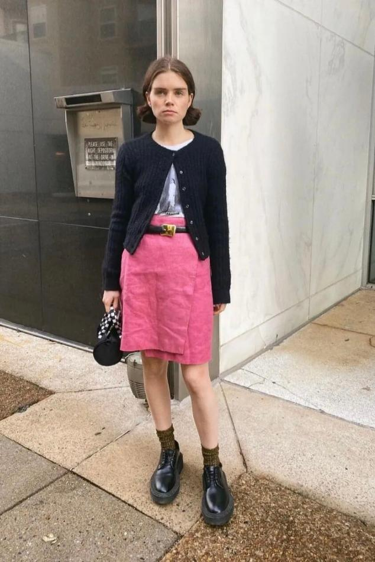

但参考通勤女孩的工作特点，半身裙会更加日常好搭一些，搭配西装或者一件柔软的针织开衫就很好。

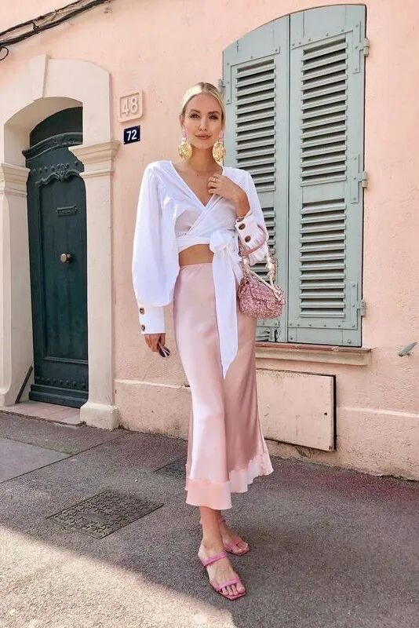

或者用基础款的白T或者白衬衫来搭配，干净浪漫的气质扑面而来。

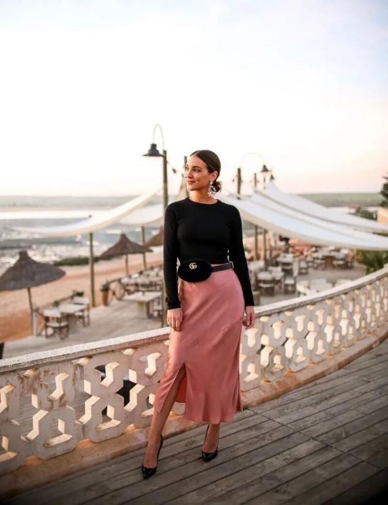

比起白粉，黑粉的撞色感可以让粉色的饱和度更加浓郁成熟，但在夏季需注意黑色的使用面积。

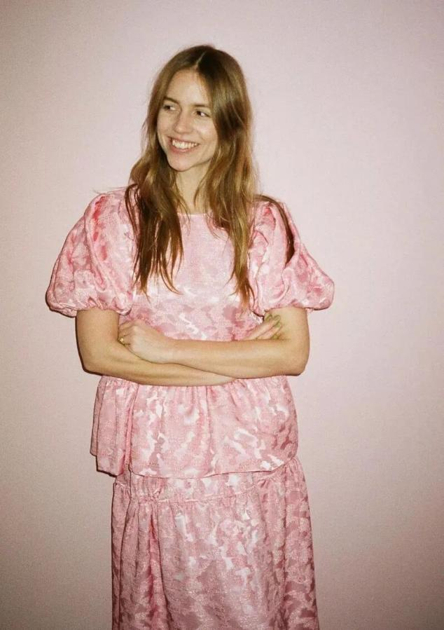

玫粉色较为强势吸睛一些，所以上装的搭配，以具有压制属性的大气单品来平衡会更加和谐。

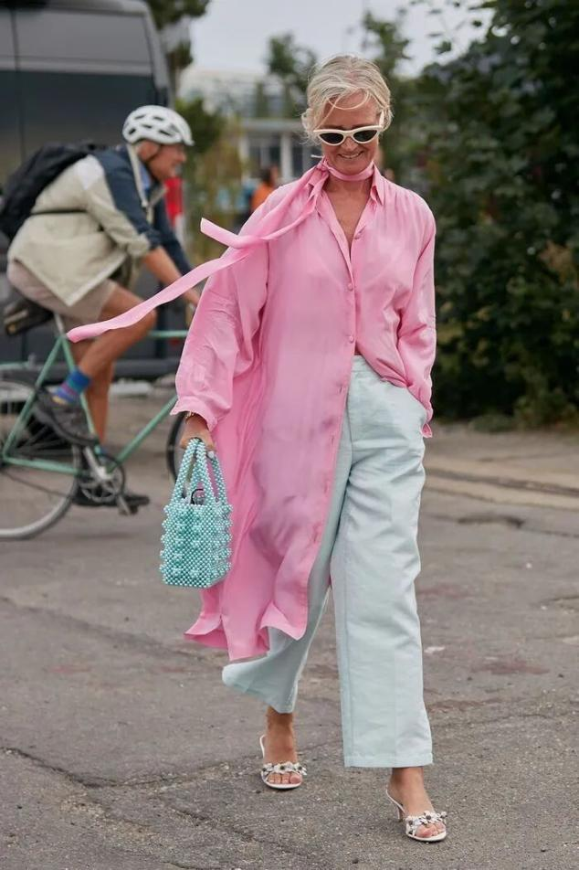

由于连衣裙的色块面积大、较为高调，若不想那么的惹眼，可以选择简约、直线条的版型来低调处理，这样也好塑造。

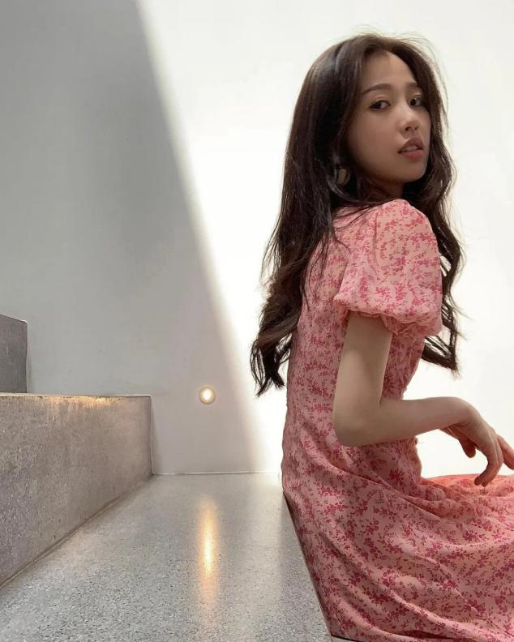

不同的粉不同的视觉语言，不同年龄驾驭，不同的气质风格。粉色的氛围与其说是颜色的功效，不如说是我们主动选择了一种更加浪漫、纯真、勇敢的美的方式。
