# 文章10：针织衫+阔腿裤=气质穿搭

很多女生可能都会不自觉地，

被有气质的小姐姐吸引，

其实她们的气场也是要靠搭配加持的，

而最气质的穿搭，

就是针织衫+阔腿裤，

这样穿可以显得有质感又很高级。

针织衫搭配阔腿裤，

总是会流露出不经意的时髦，

只要掌握好这个搭配原则，

也可以穿出高级、气质、有自己味道的时髦感。

针织衫+牛仔阔腿裤

牛仔阔腿裤是比较基础的款式，

也是你必须备好的一条阔腿裤，

用它搭配简单的针织开衫，

或者基础款的针织衫都很合适。

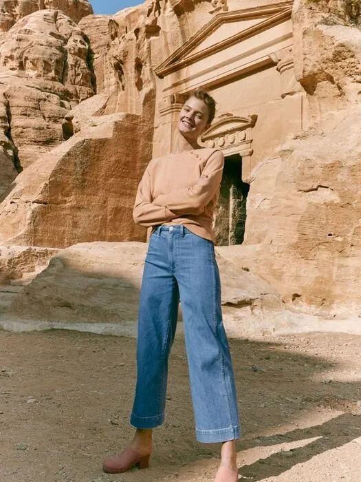

除了denim牛仔裤，

想要时髦出街，

还少不了白色阔腿牛仔裤，

可能很多人害怕白色，

觉得穿上白色就会胖10斤，

其实白色阔腿裤可以很好的修饰腿形，

搭配同色系的针织衫感觉很清爽干净。

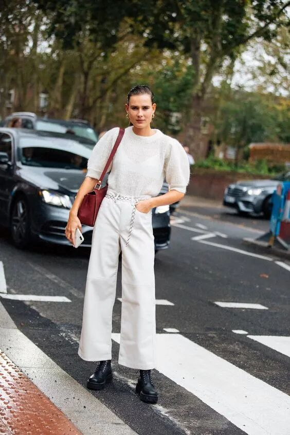

个子比较娇小的女生，

可以选择9分的白色阔腿裤，

这样的裤长会在视觉上把比例拉长，

搭配靴子或者美美的凉鞋都不会出错。

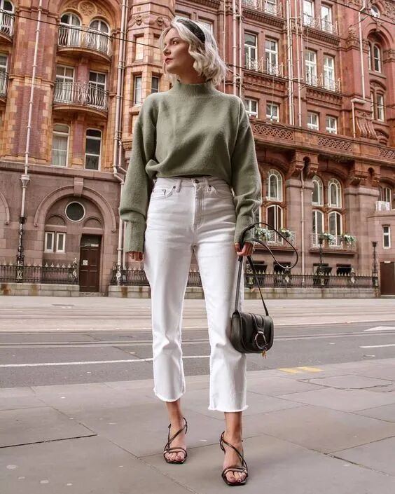

针织衫+西装阔腿裤

针织衫和西装阔腿裤，

是最优雅知性的搭配，

针织衫会给人温暖舒服的感觉，

加上西装阔腿裤天然的高级感，

这样的搭配会让人感得，

是一个自然又有品位的人。

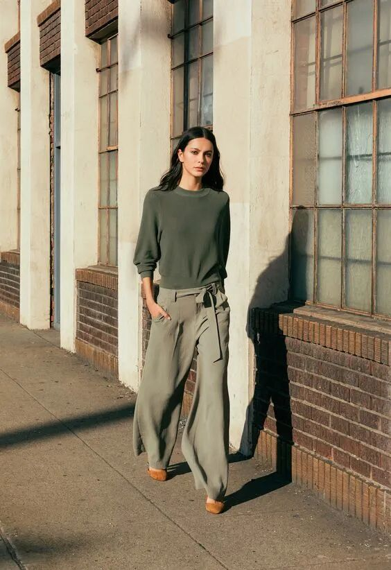

在挑选针织衫和西装阔腿裤时，

可以尝试一下同色系的顺色搭配，

顺色搭配看起来更加简洁，

并且会让身体线条看起来更加修长。

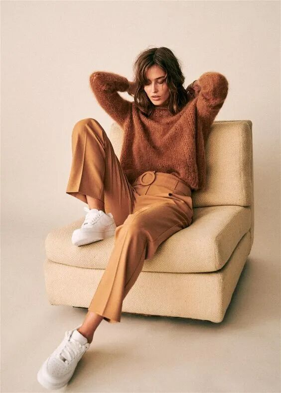

针织衫搭配格子西装阔腿裤，

可以很通勤，

也可以很时尚，

这样的组合，

会让搭配有更多的乐趣和可能。

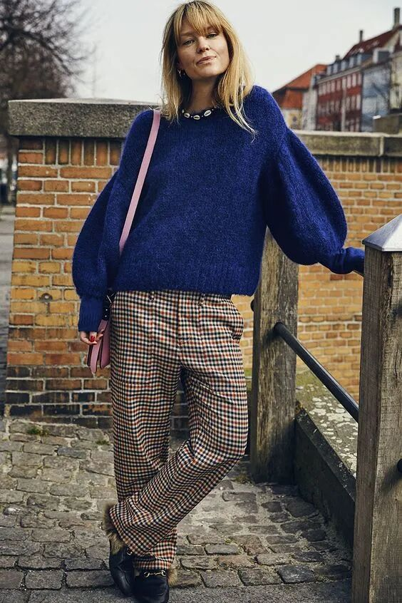

如果觉得西装阔腿裤过于保守和死板，

可以选择更有个性的针织衫款式，

这样就能避免整身搭配显得很无聊。

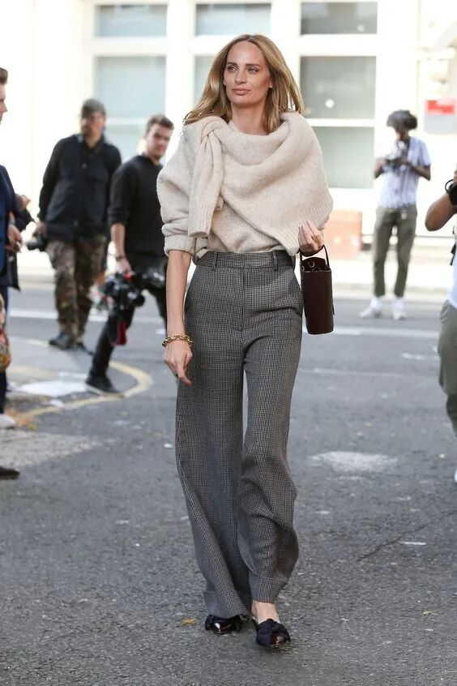

针织衫+运动风阔腿裤

运动风这几年一直都很火，

如果衣柜里还没运动款的单品，

可以先从运动风阔腿裤开始。

针织衫看起来，

好像和运动阔腿裤不是一个世界的，

其实它们搭在一起会有奇妙的化学反应。

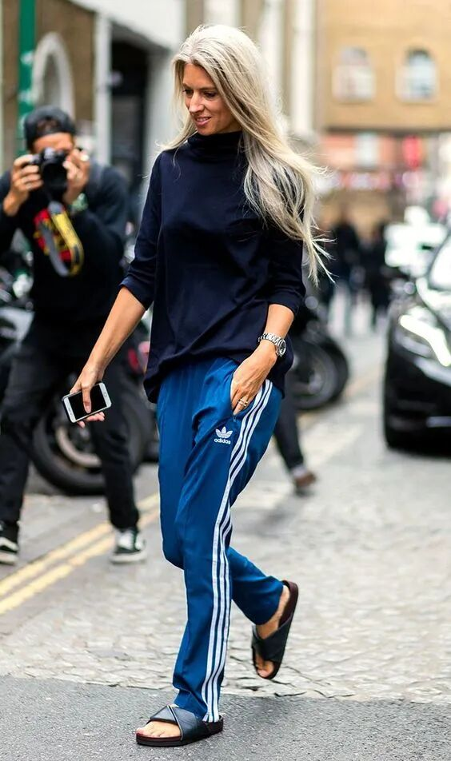

条纹阔腿运动裤，

是时尚达人人手一条的单品。

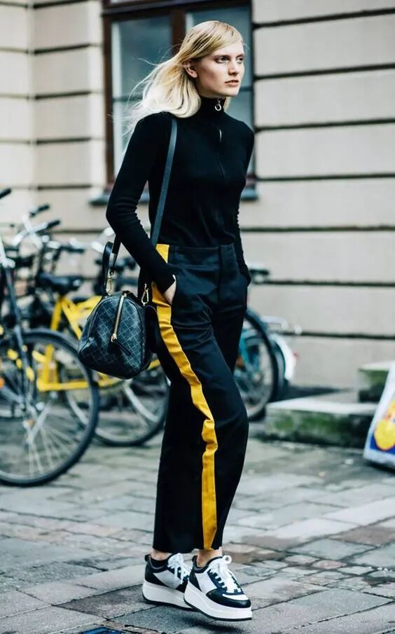

短款针织衫和运动风阔腿裤，

是最佳的搭配，

不仅可以显露出优美的腰部线条，

让腿显得更细更长，

还可以给人很有活力的感觉，

是比较减龄的搭配。

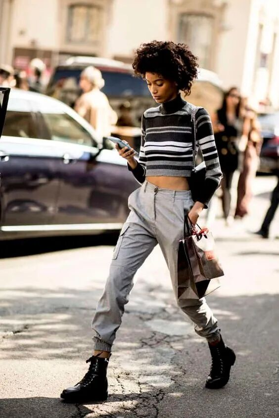

运动裤其实不只可以搭配平底鞋，

搭配高跟鞋会更有自己的个性，

针织衫和运动风阔腿裤，

可以穿出随意自然的慵懒感觉。

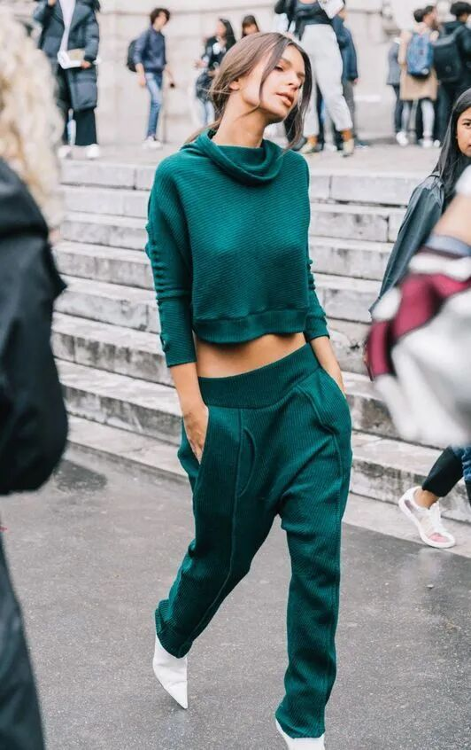

针织衫+烟管阔腿裤

烟管裤的版型很经典，

材质也很有质感，

穿上针织衫和阔腿烟管裤，

可以一秒变身优雅名媛。

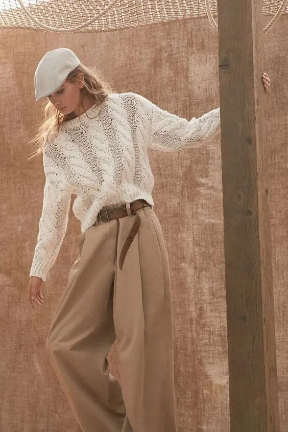

烟管阔腿裤不挑腿形也不挑身材，

即便你对自己的腿形很没有自信，

也可以尝试一下烟管阔腿裤，

卡其色的搭配最经典。

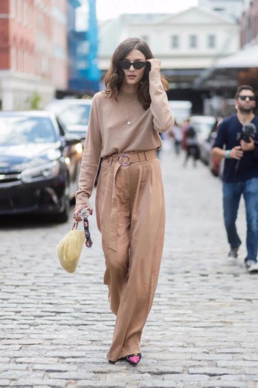

白色的烟管阔腿裤，

非常适合春夏，

也让原本比较正式的烟管裤，

显得更加轻松休闲。

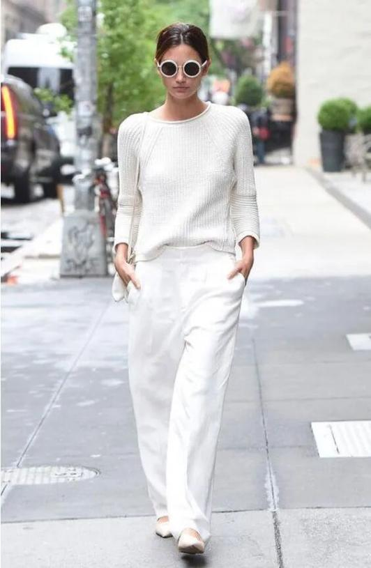

烟管阔腿裤和针织衫，

也可以搭配出很酷的感觉，

穿上一双帅气的短靴，

你就是最飒的酷girl。

针织衫+阔腿裤是很显气质的穿搭。针织衫亲肤百搭，阔腿裤可以很好的修饰腿形，这样的搭配可以让你穿出轻松惬意的时髦。精致的时尚风格是不经意间流露出的想法和品位，适合自己才是最重要的。
