# 文章11：轻俏不俗的浅口芭蕾舞鞋，很适合夏天

今天说一说赫本的鞋子，以往都是一些她的服装和配饰，而她的鞋子其实也是很讲究的。

她格外偏爱这种浅口的芭蕾舞鞋，几十年如一日的用这双鞋来跟她共事、跟她出席活动、去很多的地方。

这种陪伴就像她喜欢用白衬衫表达她的纯粹和典雅，也像她喜欢用卡普里长裤，展现轻盈姿态，更像她专爱针织开衫那样，体现一位女性的得体温柔。

而这种既有成熟女性的优雅，也有少女俏丽感的鞋子，非常符合赫本自身气质里面的轻灵和细腻。

不管是裙子裤子还是短打，一双轻俏不惹俗气的鞋子，几乎可以无差别的融入到一位女性的生活中。

黑色经典、白色柔雅，露出脚面薄薄的一片，外加一双纤细脚踝，女人的稳重和轻盈在这双鞋上实现了和谐共融。

这也是赫本偏爱它的缘由。

芭蕾舞鞋

搭配直筒裤

这种具有舞者气质的鞋，非常受法国女人的支持，很多法国博主几乎不分春夏秋冬，不分任何风格流派，一双利落修长的九分裤，是芭蕾舞鞋最好的伙伴。

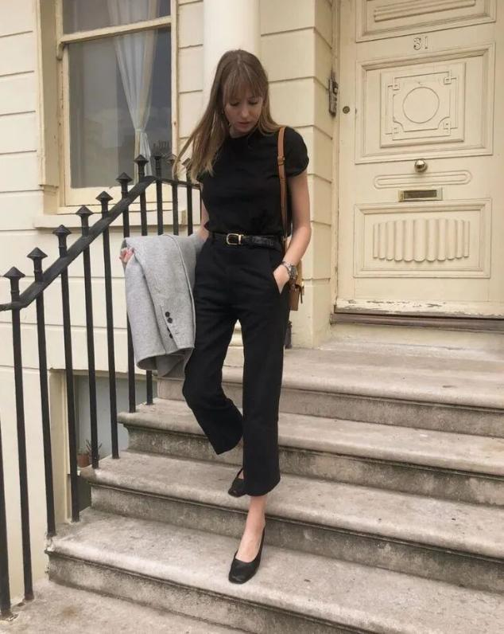

本身芭蕾舞鞋自带轻巧灵动的秀气之美，叠加裙装是两种感性美的融合，风格过分统一，少了一些出其不意的反差魅力。

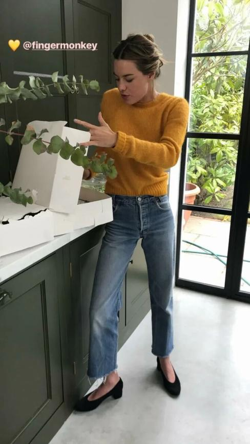

所以正好，正好裤装的中性化味道，以及它背后潇洒大气的风格，用来接洽轻盈纤细之美，反而格外凸显一位女性的柔软和灵气。

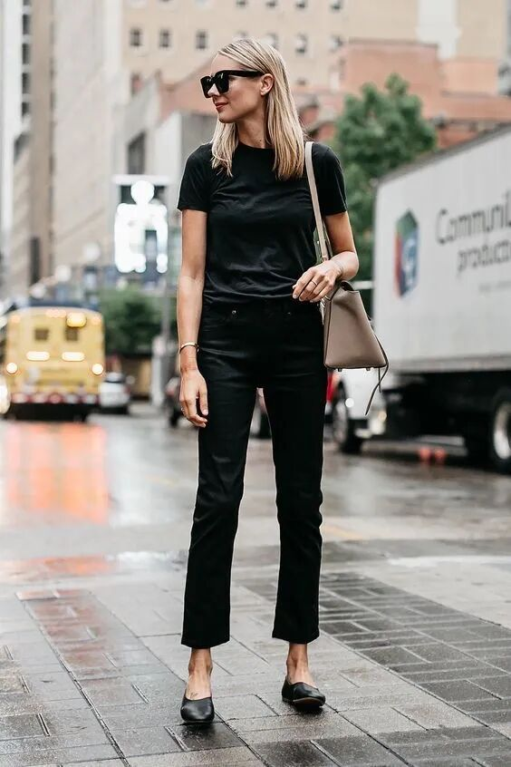

黑色芭蕾舞鞋

特别是黑色系的芭蕾舞鞋，对于脚背可以起到一部分瘦脚的功能，同时黑色的经典百搭，把它放置在任何场景里，都是合理且合适的。

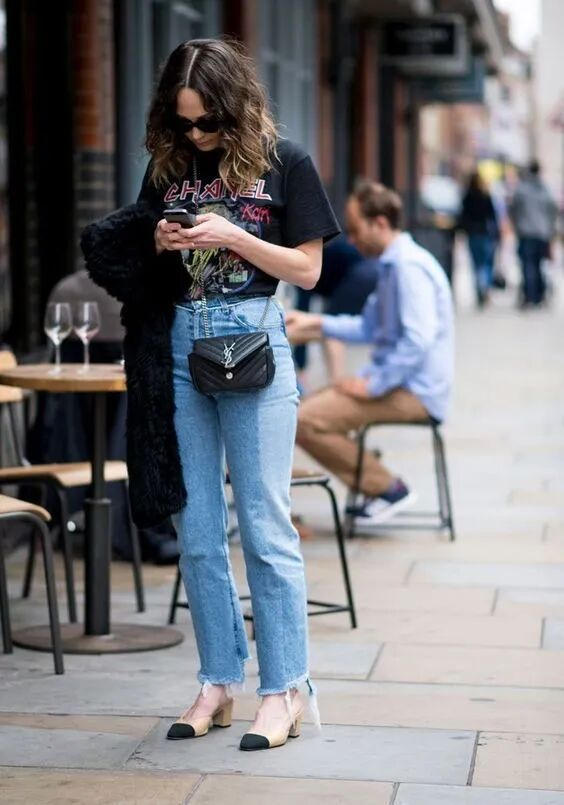

脚踝不好看

因为芭蕾舞鞋在脚背脚踝部位，没有任何遮挡，所以起不到任何掩藏作用，如果你是脚踝不好看或者有肉的腿型，更建议用长九分裤来搭配，最好垂在外踝关节，这里最有显瘦效果。

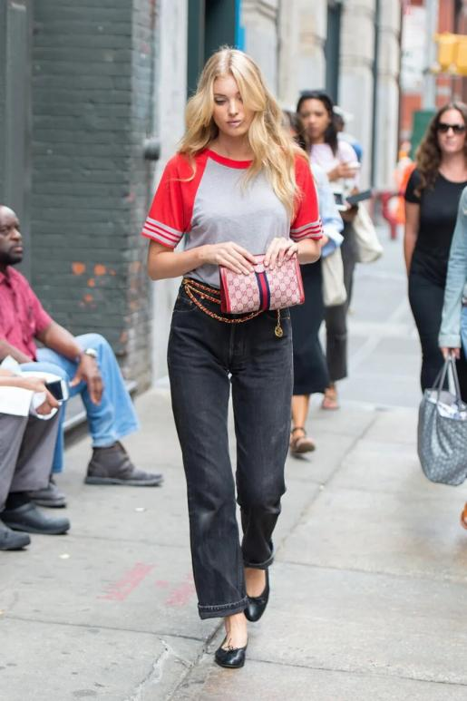

脚背不好看

也有一些女生不愿意露脚背，或许觉得不美观，或者脚的颜色没有那么白皙，那么就可以用一双白色袜子来搭配。

很多日杂里面，非常喜欢用这种方式来展现文气、英伦，讲究的穿衣品质，而且袜子与裤腿之间的层次还可以无形拉长腿部。

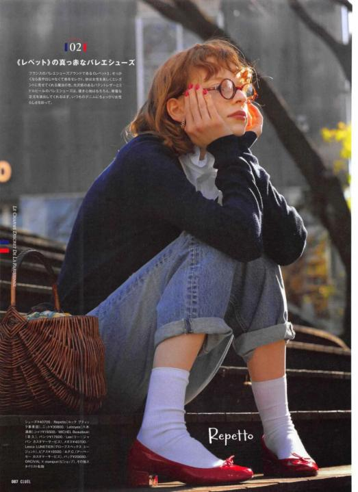

个子矮

如果是矮个子女生，平底芭蕾舞鞋对于个头没有任何修饰提升作用，所以最好选择一点带跟的，但不能太高，那样的话浅口会带不起来。

最好选择3厘米左右的跟，这样既能巧妙增高，又不破坏鞋型的美感。

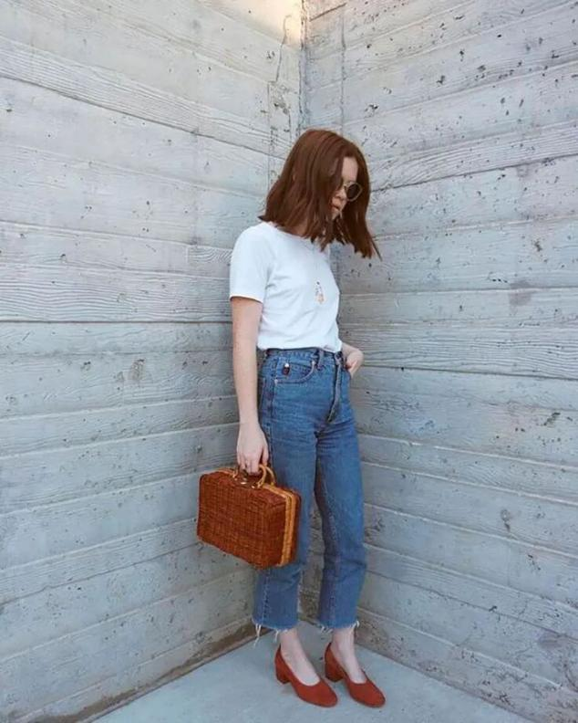

橘红色芭蕾舞鞋

除了经典款的黑色，其实橘色和红色系的芭蕾舞鞋要更加抢眼复古一些，特别是搭配基础款穿搭的时候，不需要任何多余的点缀，一双鞋足够让整体焕然一新。

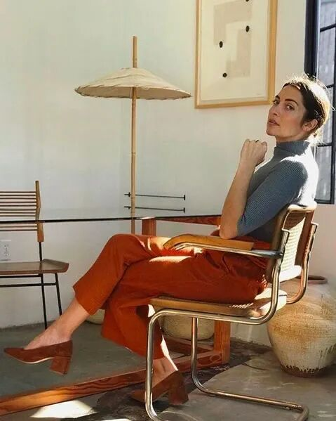

不同的红调不同的感觉，橘色拥有秋的诗意氛围，大红色鲜明女人味，酒红色神秘贵气，但不管选择哪一种，红色总是不出错的法宝。

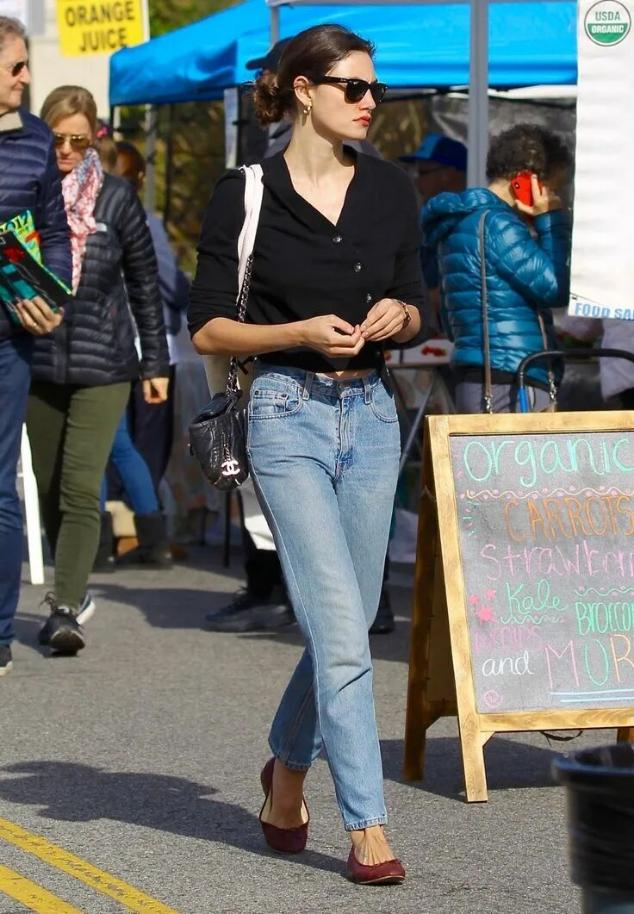

搭配连衣裙

同属于女性气质比较浓郁的裙装，虽然没有裤装那么具有反差魅力，但是裙装跟芭蕾舞鞋具有同源之美——同样的优雅细腻，同样的浪漫轻盈。

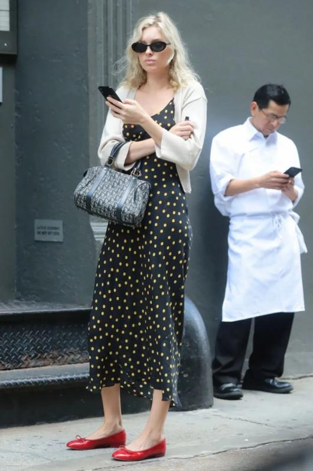

特别是在夏季，不管是碎花连衣裙或者波点连衣裙，如果想要凸显裙子的重要性，鞋子可以选择基础经典色，如果想要凸显鞋子的魅力，红色芭蕾舞鞋最点睛。

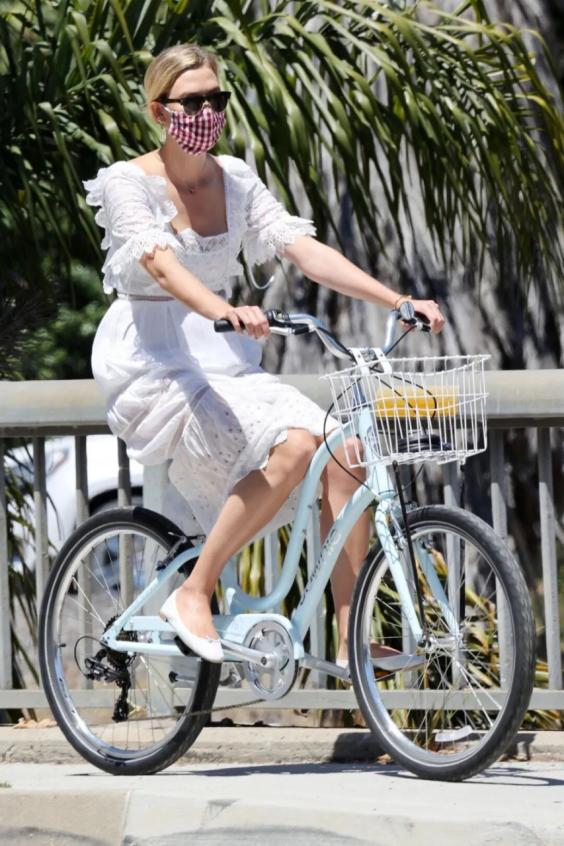

也可以选择同样经典大方的黑白色裙装，特别是简约连衣裙配开衫，加上芭蕾舞的秀气，优越典雅的不得了。

想要浪漫轻盈，白色连衣裙配白色芭蕾舞鞋最适宜。而全身性的黑色装扮，可以令黑色芭蕾鞋更加的经典风范。

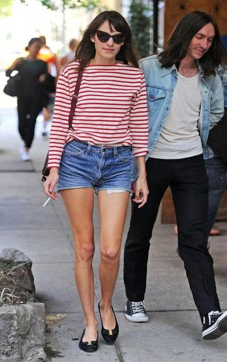

赫本的美已经超越了时代和国家，我们能从她这里获取的，不仅仅是她选择了什么，还有她因为什么而让一种选择成为永不落幕的标志。
