# 文章13：穿真丝的女人，挺时髦！

很多人想在夏天穿得舒服又高级，但好像有点难？其实选对面料就成功了一半，这个夏天不如来试试真丝，可日常可slay，你想要的风格它都有。

可能有人要问：什么是真丝？

真丝一般指蚕丝，含有18种对人体有益的氨基酸，可帮助皮肤维持表面脂膜的新陈代谢，让皮肤滋润光滑。

所以真丝被称为会呼吸的面料，质感丝滑又很透气，自带一丝不可多得的优雅高贵风格，搭配简简单单的设计就可以拥有精致感。

设计师们都无法拒绝它的魅力，T台上少不了真丝单品的身影 👇

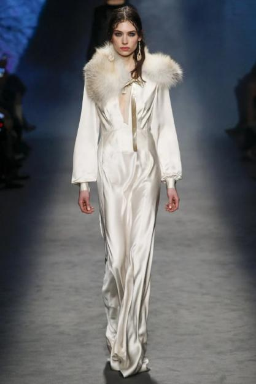

S姐觉得在炎热的夏季最不能缺的就是一件真丝衬衫了，清凉舒适，重点是真的超级好穿！

它历来是各种高级或正式场合的必备，成为众多优雅女性的首选单品 👇

对于职场女性来说，真丝衬衫最适合pick了，帮我们不费力就打造出高级的职场穿搭，塑造出干练形象。

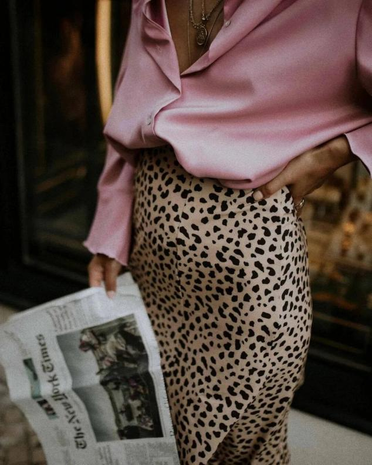

普通白领怎么穿？

对于出入职场的小白来说，一身得体的服装就是一张很好的名片，推荐大家尝试真丝衬衫搭配裤装的穿法，捎带一点正式感又hin时髦。

👉：真丝衬衫+牛仔裤

真丝面料没有想象中那么难搭配，牛仔裤的随性休闲特性遇上高级感满满的真丝衬衫，能让人眼前一亮，最简单的套路非它莫属了。

划重点：牛仔裤要高腰！这样提高腰线效果更佳！

除了常见的基础色系，也可以尝试代表夏日气质的颜色，比如浪漫的蓝、生机勃勃的绿，搭配牛仔裤绝对不会踩雷，这样穿去上班的你，时尚感妥妥甩其它小白几条街呢~

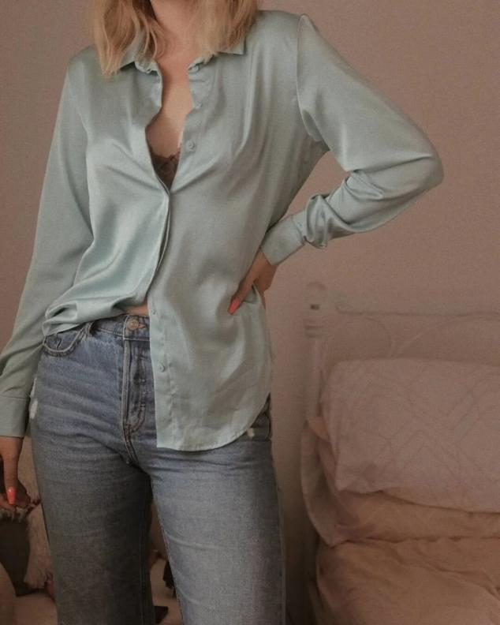

当然黑色也可，显瘦指数可给⭐⭐⭐⭐⭐，搭配同色系牛仔裤更有一种时髦魅力，哇哦，墨镜一戴谁都不爱，可以说是酷女孩的专属，和无趣的职场穿搭说再见。

真丝花衬衣搭配牛仔裤和同色系西装，举手投足诠释干练风范。这里教大家一个小tip，不知道怎么选搭配的时候，首选同色系，相互呼应又保持和谐感，棒！

进阶穿法是在衬衫下摆打上一个结，有趣又不过于高调，去参加聚会或和姐妹逛街，再合适不过了。

👉：真丝衬衫+阔腿裤

真丝衬衫搭配阔腿裤的穿搭也正在流行，比牛仔裤的穿法更正式气质一些，同时呈现出不俗的时尚感，是永不过时的经典组合。

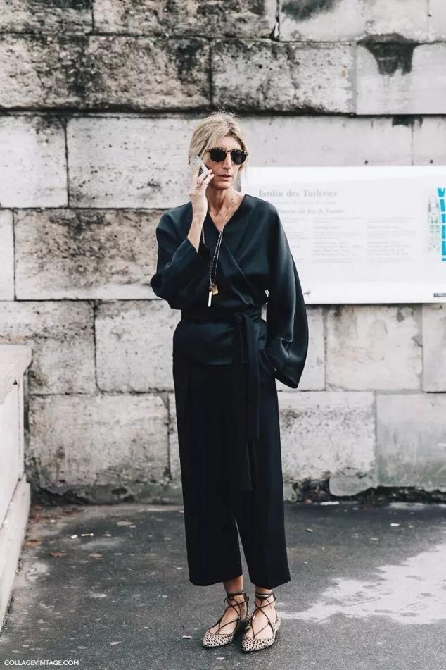

穿法上可以随意解锁，像这种长款衬衫也可以尝试，搭配格纹裤颇具摩登感，还蛮飘逸的。

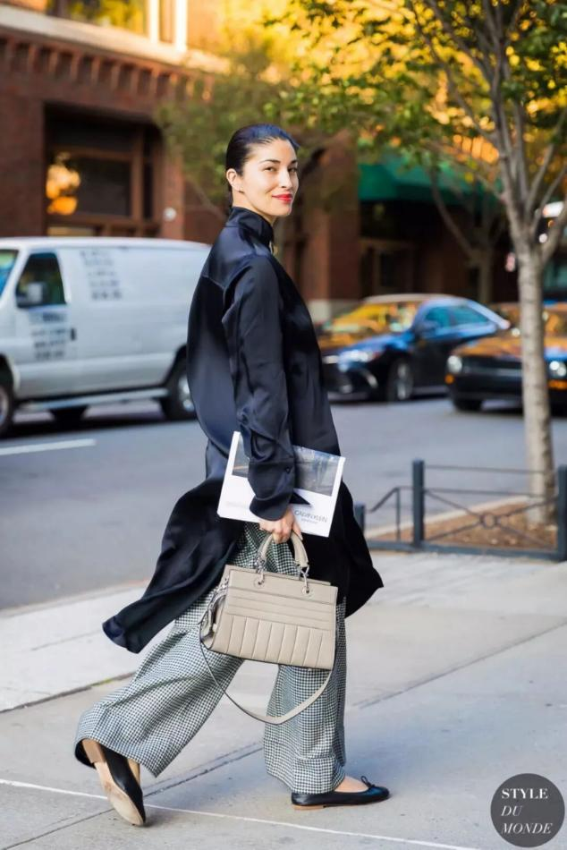

真丝这种材质，颜色过于艳丽反而容易失去质感，所以衬衫选择深沉一点的颜色会更时髦哦，搭配百搭阔腿裤就赢很大。

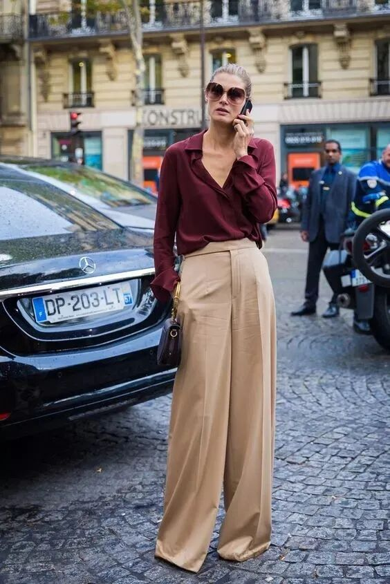

有些博主还喜欢用亮色下装来呼应上半身，这种穿法时髦极了，但过于考验搭配功力，不是谁都能hold住的。

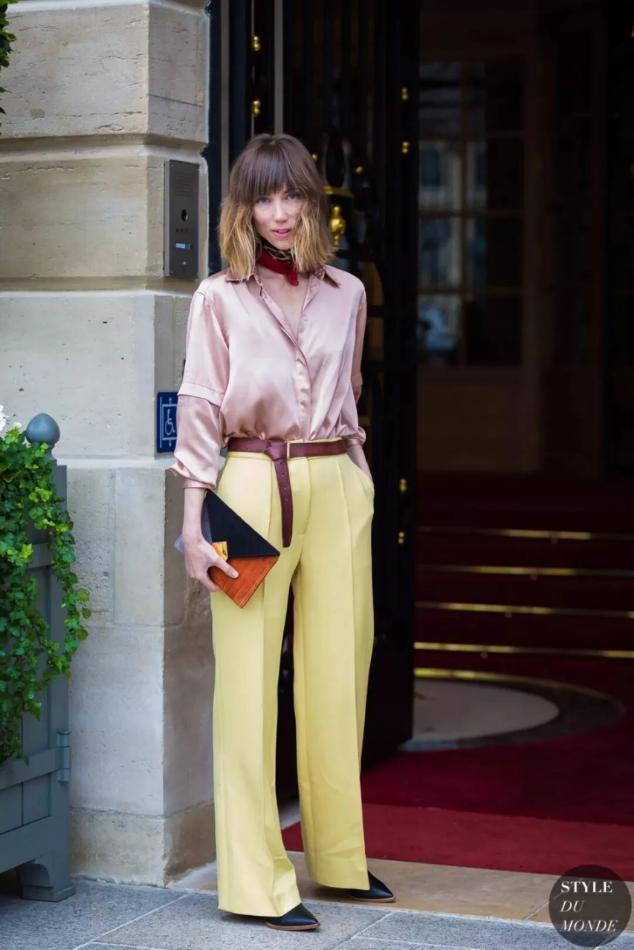

less is more，如果你喜欢简约利落的风格，可以看看下面这些配色，好学又好看！搭配腰带更显高，还增加造型层次感，别偷懒，快来抄作业！👇

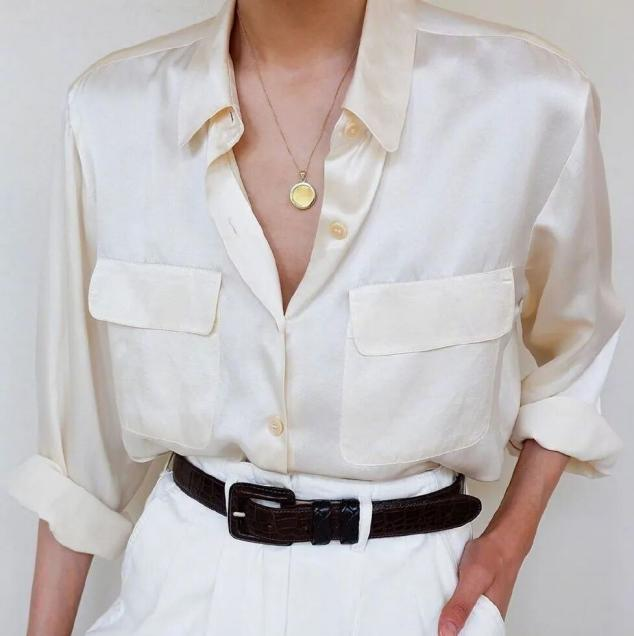

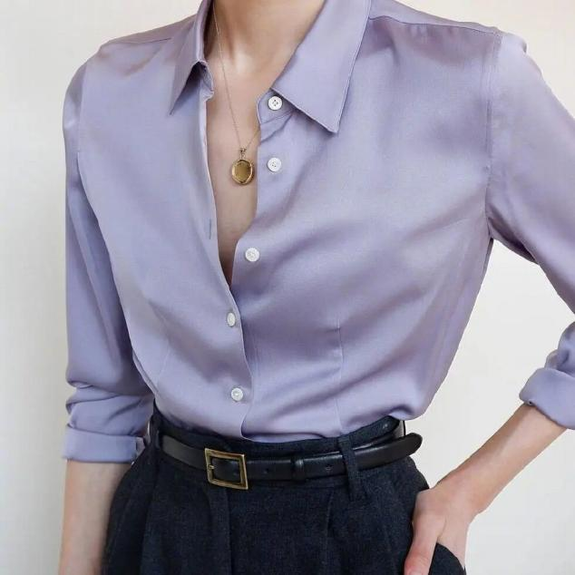

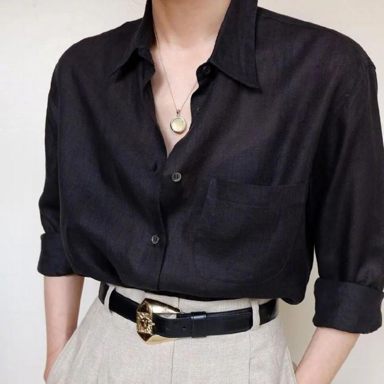

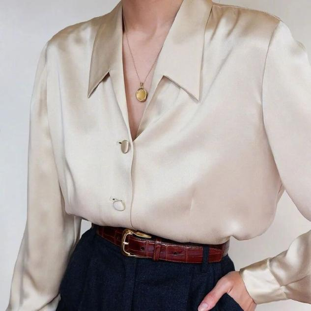

优雅女强人怎么穿？

女强人们大部分比较雷厉风行，她们有最飒的外表也有柔软的内心，真丝衬衫+半裙的穿法很符合这类人的特性，赶紧学起来。

👉：真丝衬衫+半裙

谁的衣橱里会少了一条半裙呢，搭配一件飘逸的真丝衬衫，既浪漫又优雅，妥妥的office lady的标配。

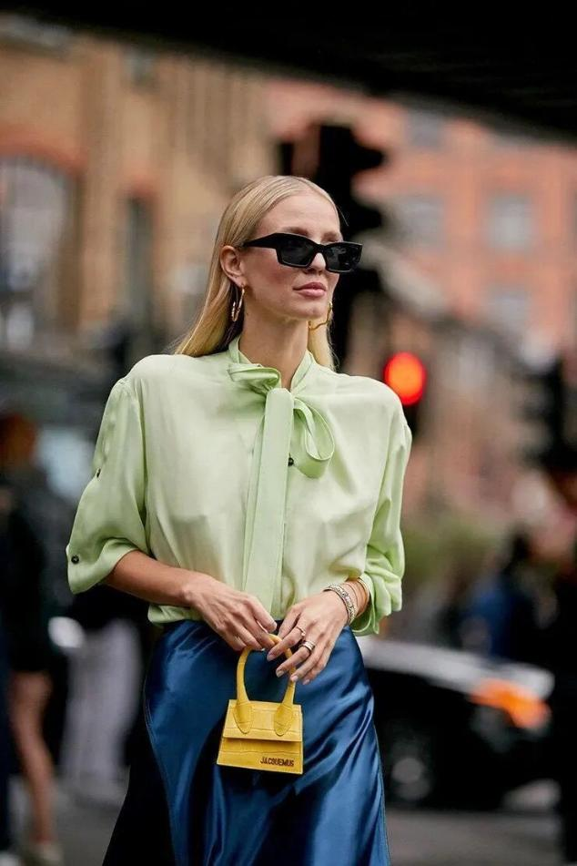

不知道该怎么选半裙的款式的集美，当然是首选显瘦又好驾驭的A字版型，搭配最简单的配色就够了，如果上衣较长，别忘了系上腰带打造小蛮腰。

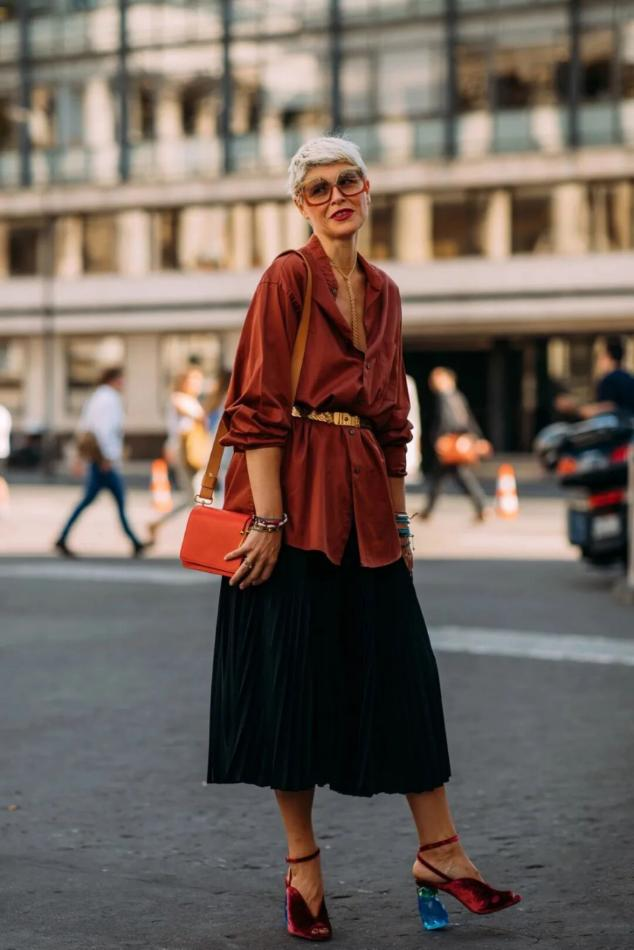

职场女性都喜欢买黑色半裙，穿多了容易审美疲劳，快试试搭配一件高级的真丝衬衫，有“起死回生”的感觉，造型自带气场，走路带风~

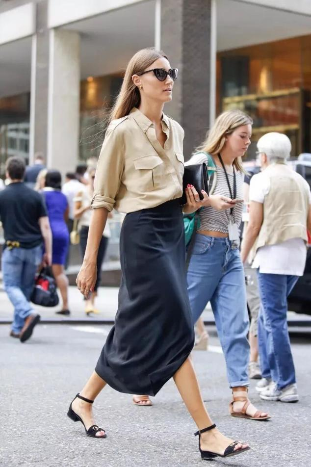

白色真丝衬衫也很常见，无需“黑白配”，可以穿上一条设计简单、配色出彩的半裙，体验优雅与浪漫并存的风格，还能减龄好几岁~偶尔试试会有惊喜！

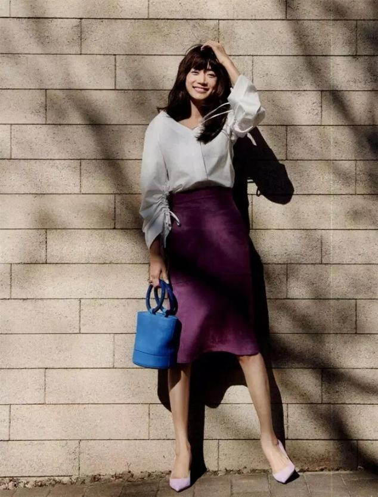

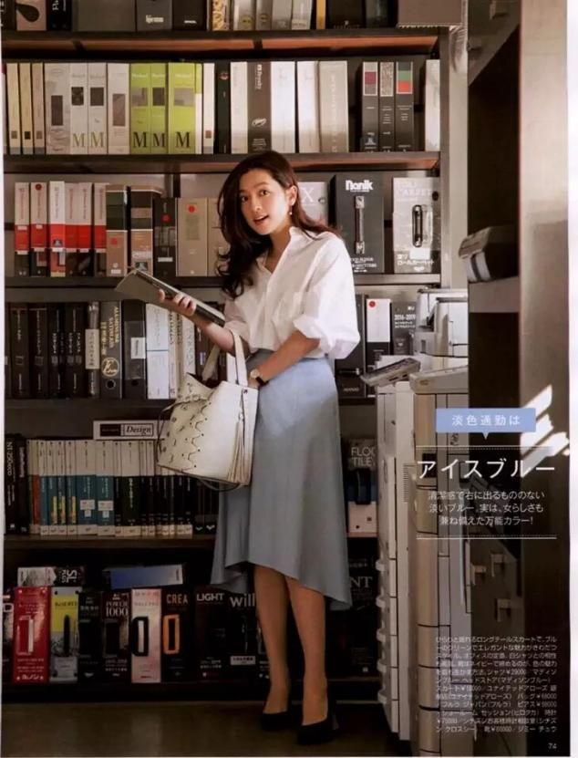

将高级进行到底！半裙裙摆来点开叉或褶皱的设计，整个造型打破常规，显得更加性感撩人，时髦感飙升！

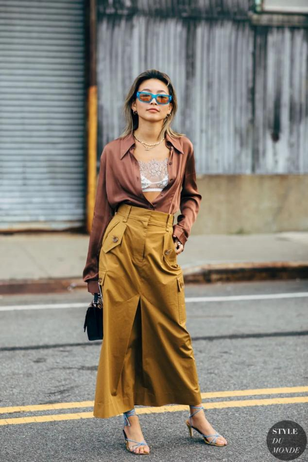

上一秒你还在职场兢兢业业，下一秒就可以去街拍slay了，随意切换风格！

最后，再来说说真丝的保养tips，想让喜欢的衣服陪你更久，就要好好呵护哦~

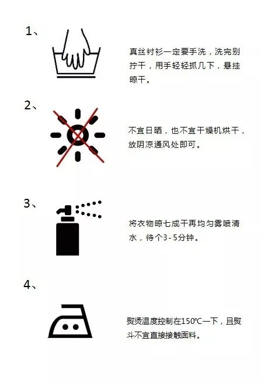

穿真丝女神们，在这炎炎夏日，一起来拥有这不费力的高级感吧~
