# 文章14：亚麻，让人爱的高级清爽

天气真是越来越热了，如果让S姐选一件夏日衣服，首选一定是亚麻了。

它的散热性很优越，是羊毛的5倍、真丝的19倍，上身比其它面料感觉凉快3～4℃，适合炎炎夏季。

01

亚麻衬衫

上班最需要的就是衬衫，亚麻面料的衬衫给人感觉hin清爽，如果加上高级的配色，那更不失正式感，妥妥的上班族中衬衫穿搭首选。

亚麻衬衫一般都以纯色为主，彰显出面料的天然感。拿不准该怎么选的你，试试白色款，不挑肤色又自带高级气质，夏天穿真的很清爽。

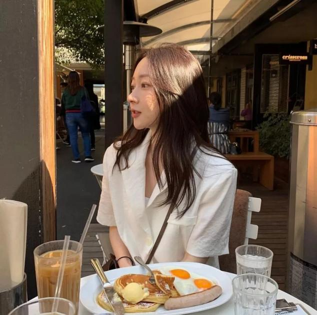

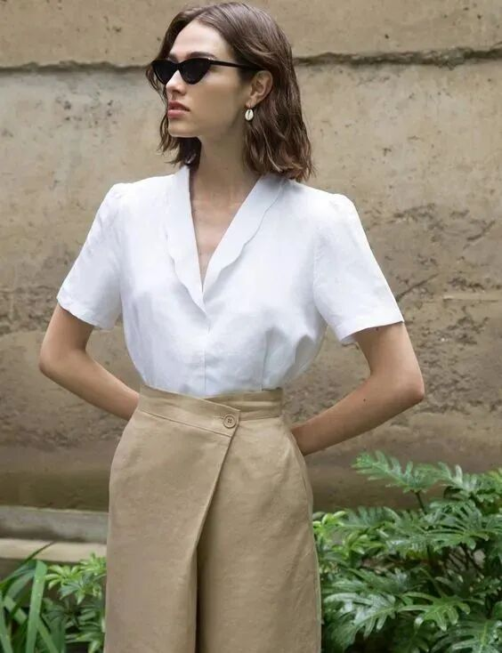

亚麻衬衫可以和不同单品match更多风格，比如搭配最常见的驼色下装，文艺又很夏日，任何一个女生都可以驾驭。

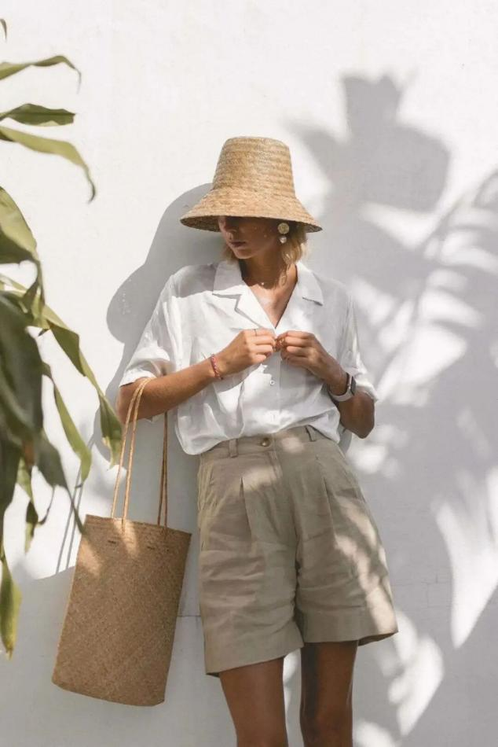

很多人都说想把白上衣+亮色下装穿得美真的好难，其实风格反差感较强的亮色下装搭配亚麻白衬衫就很值得尝试，减龄又高级，日常通勤时看似随性却让人眼前一亮。

职场里最得体的衬衫，当然不局限于只能穿白色，这个季节不妨选择一些更有趣的颜色。

粉色的色调在夏天里是非常清新少女的颜色，试试搭配驼色阔腿裤，粉驼的颜色组合看似简单，却能让你的日常look与众不同。

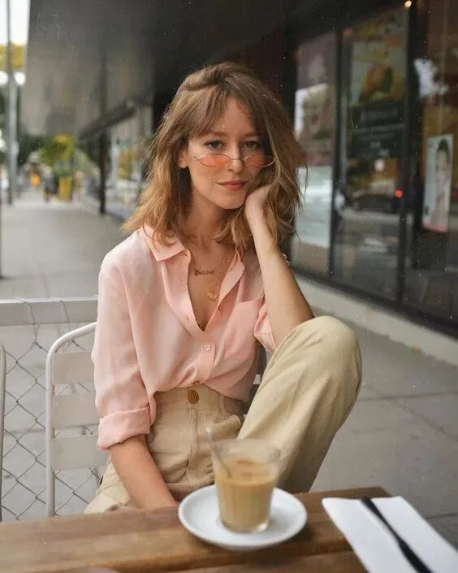

搭配蓝色亚麻衬衫则更显白大气，肤色黑的集美可以大胆尝试。

紫色亚麻衬衫还有一丝浪漫情怀，想走温柔路线的可以直接pick，再根据自己的腿型选择直筒裤还是窄腿裤，踩上一双高跟鞋打造职场气势派头，比起普通的衬衫look抢眼不少。

亚麻面料的衣服超级适合夏天当作防晒服，同时又很适合作为小外套，在夏天的空调房里穿正合适。平时在办公室的时候可以外套一件长袖亚麻衬衫，让自己不受凉。

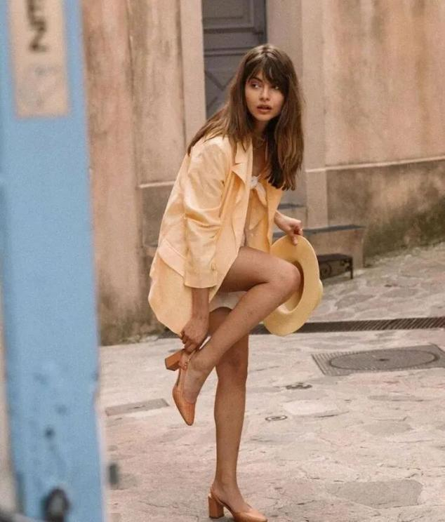

发现了吗？一件好看的亚麻衬衫可以让你在通勤时刻轻装上阵。如果只能买一件的话，那一定要有V领设计，修饰锁骨又修饰脸型，最好加上高级的配色，不仅穿起来清爽，看起来也清凉显白。

02

亚麻连衣裙

不管是职场还是平时穿搭，夏日怎么能少了一条简约连衣裙？如果能和亚麻做结合那会更完美，柔软的质感、降温性将与清爽的白色碰撞出独特的时髦感。

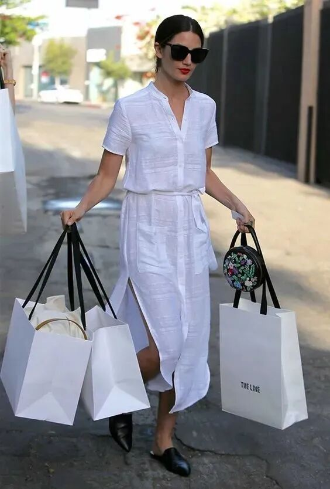

时髦精们都爱上了白色亚麻连衣裙，搭配一个黑色购物袋，随性又方便，很适合平时通勤穿。

放假了还可以搭配一顶草帽或一个草编包，立马切换度假模式，让你在职场和生活自由转换，真是一裙多穿。

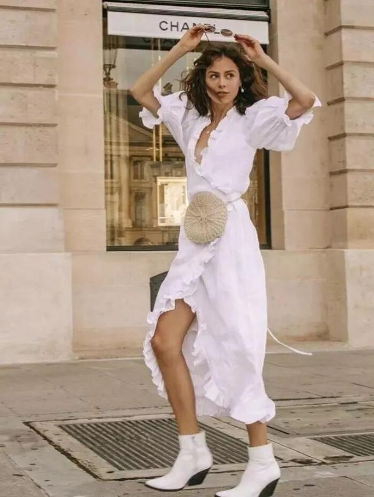

V领、腰间绑带设计让你变得干练起来，可以根据场合搭配一件同色系薄西装、精致首饰，是不是立马有了一种职场女强人的既视感。

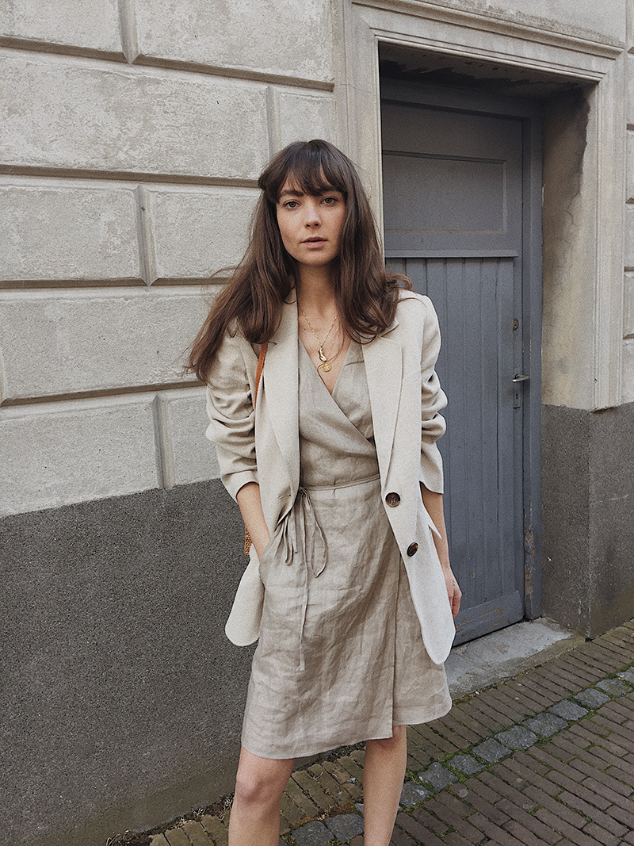

微胖星人也不用担心自己hold不住，选择中长款的加上收腰设计，可以遮盖腿粗缺点，又能修饰腰部的线条，做一个打扮得体的职场丽人。

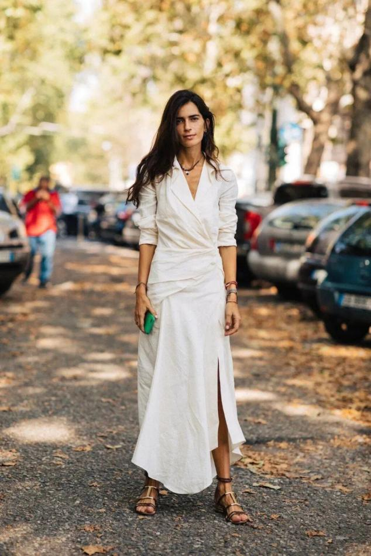

中长款泡泡袖与亚麻面料也可完美匹配，遮住肩膀和手臂的赘肉~身材不够完美的集美一定要学会扬长避短。

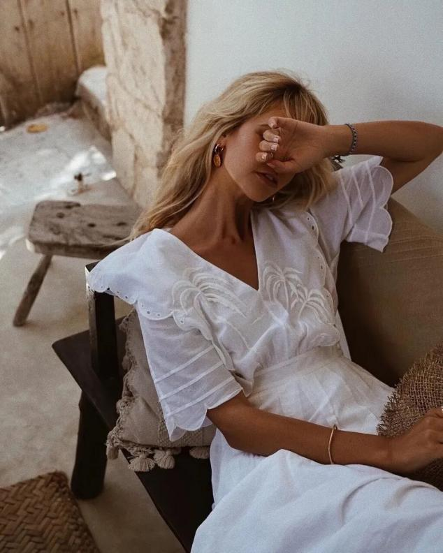

03

亚麻下装

在职场中不适合穿得过于花哨幼稚，还是简约高级的路线更保险，衬衫和半身裙就是最不费力又不会出错的选择。

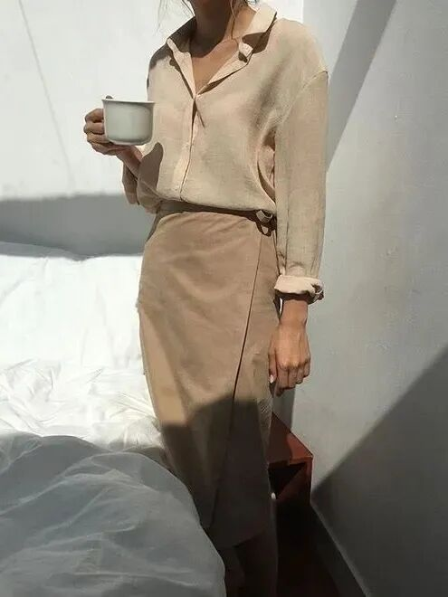

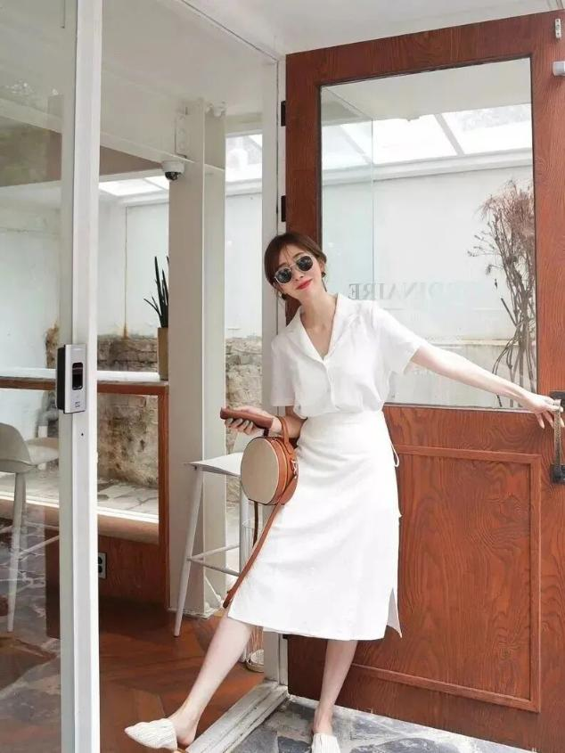

亚麻半裙，搭配同为亚麻面料的衬衫不仅穿着舒适，办公时还给人一种利落感，不拖泥带水。

一套经典的黑白配look满足了职场通勤需求，搭配一双凉拖又能混搭出减龄休闲范儿，简单！

亚麻短裤当然也不能少，它的挺廓效果不明显，带着些自然的褶皱感，夏天穿起来有种飘逸的随性感。

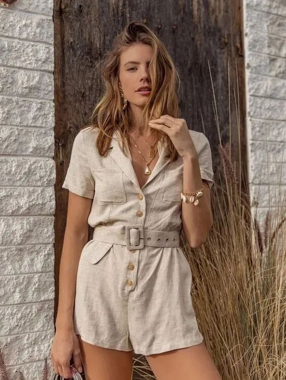

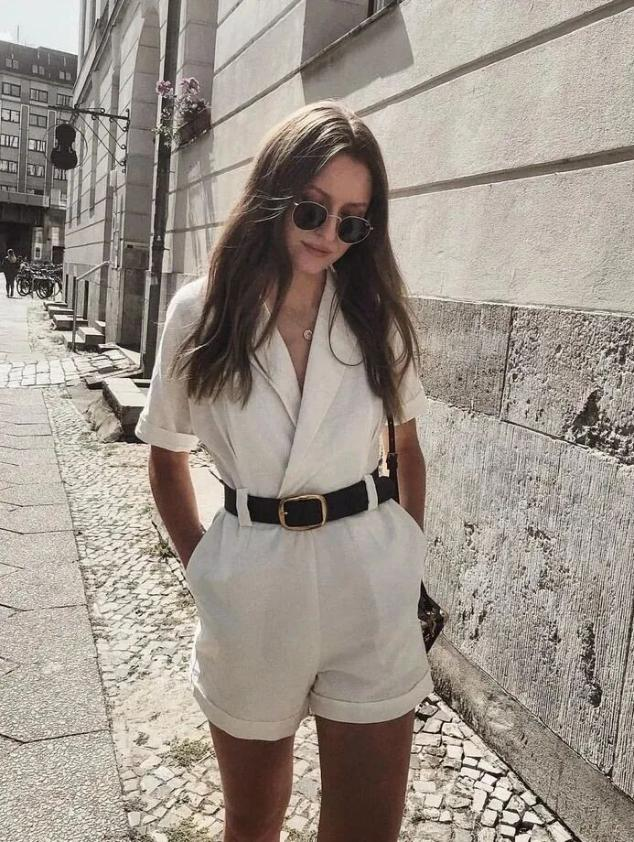

只要搭配一条腰带，风格立马从休闲转为干练，哪个职场lady会不爱这样的搭配？

时髦精们还解锁了成套穿，将亚麻短裤和西装外套凑成一套穿，风格可正式可休闲，这几乎是每一个职场女性都不会错过的搭配，正规场合成套穿，一般应酬拆着穿，省事~

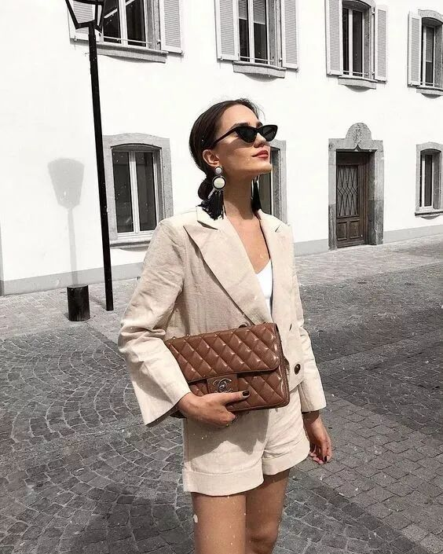

白色或者淡漠色之类的浅色系，在视觉上会轻盈透气很多，但条纹款式其实会更显瘦，内搭一件纯色T就很有层次感。

皱一点也好看，这个夏天尝试亚麻单品带来的不一样的时髦与品味。选对亚麻单品，一周职场穿搭不重样，高级与清爽都轻松get。
